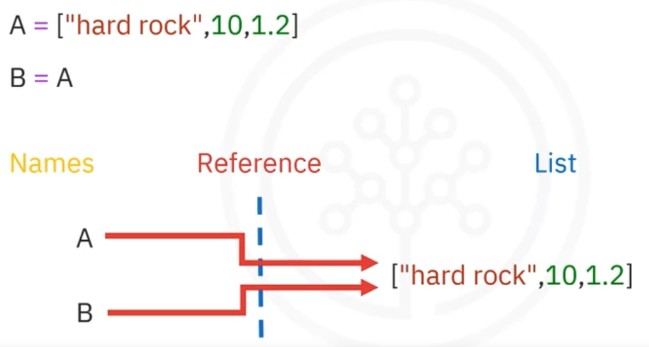
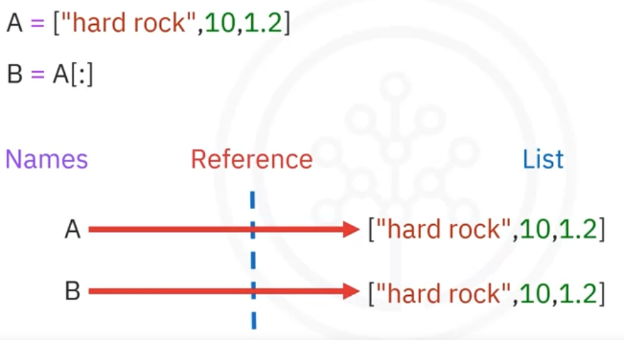

# 2.2 Lists []

- A list is also a sequenced collection of objects.
- Lists can contain strings, floats, and integers. We can nest other lists, and we can also nest tuples and other data structures, such as integers, strings, and even other lists as well. The address of each element within a list is called an **index**. An index is used to access and refer to items within a list.
    
    ```python
    # Sample List
    ["Michael Jackson", 10.1, 1982, [1, 2], ("A", 1)]
    ```
    

- Key difference with tuples: lists are **mutable**.
- The same indexing conventions apply for nesting.

```python
List1=[1, 2.2, “hello”]
type(List1)= list

**# List slicing**
L[3:5]

**#Lists are mutable**
A=["disco", 10]
A[0]="hard rock" #output A: ["hard rock", 10]
**del**(A[1]) #it will **delete** 10 from the list

# **Split** the string, default is by space
'hard rock'.**split**() #output: ['hard', 'rock']
# **Split** the string by comma
'A,B,C,D'.**split**(',')#output: ['A', 'B', 'C', 'D']

**#List methods:**
L=["Andrea", 7.2, 1992]
#**extend**: add various new elements to the list
L.**extend**(["music", 10]) #output L: ["Andrea", 7.2, 1992, "music", 10]
#**append** (adds only one element: add only one element 
L.**append**(["pop", 7]) #output L: ["Andrea", 7.2, 1992, "music", 10, ["pop", 7]]
```

- **Aliasing**: multiple names referring to the same object is known as aliasing. When we set one variable **B** equal to **A**, both **A** and **B** are referencing the same list in memory:
    
    
    
    A and B are referencing the same list, therefore if we change A, list B also changes.
    
- **Cloning**: Syntax `B = A[:]`
    
    
    
    Variable A references one list. Variable B references a new copy or clone of the original list. Now if you change A, B will not change. 
    
- **Usage**: Typically used when you need a collection that changes over time (e.g., a list of tasks).