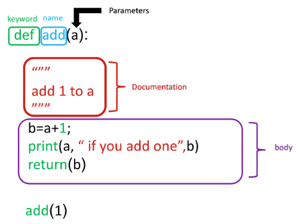

# 3.3 Functions

A function is a reusable block of code which performs operations specified in the function. They let you break down tasks and allow you to reuse your code in different programs.

There are two types of functions :

- **Pre-defined functions:**
- **User defined functions**

## Pre-defined functions

A **built-in function** is a function that is globally available in Python without requiring an import or a specific context. These functions are defined at the core level of Python or provided by the standard library. Some examples we already used are: `print()`, `len()`, `sum()`, `range()`, `slice()`, `sorted()`…

- [Link to python built-in functions (w3schools)](../img/https://www.w3schools.com/python/python_ref_functions.asp)
- [Cheat sheet](../img/3%203%20Functions.md)

> Not to be mistaken with methods, which are associated with a specific object (or class) and operate in the context of the object it belongs to and may use or modify the object's internal data. Examples:
> 

| **Aspect** | **Built-in Function** | **Method** |
| --- | --- | --- |
| **Scope** | Global | Specific to an object or class |
| **Call Syntax** | `function_name(args)` | `object.method(args)` |
| **Defined In** | Python's built-in library | The class of the object |
| **Behavior** | Can work on multiple object types | Context-specific to the object |

## User defined functions

You can define functions to provide the required functionality. Here are simple rules to define a function in Python:

- Functions blocks begin `def` followed by the function `name` and parentheses `()`.
- There are input parameters or arguments that should be placed within these parentheses.
- You can also define parameters inside these parentheses.
- There is a body within every function that starts with a colon (`:`) and is indented.
- You can also place documentation before the body.
- The statement `return` exits a function, optionally passing back a value.

```python
# Simple function example

def add(a):
    """
    comment inside function: add 1 to a
    """
    b = a + 1
    print(a, "if you add one", b)
    return(b)
```



```python
# Define a function with multiple parameters

def Mult(a, b):
    c = a * b
    return(c)
    print('This is not printed') #return statement terminates de function, so this code is nevrer executed
    
result = Mult(12,2)
print(result)

Mult(10.0, 3.14) #You can multiply floats
Mult(2, "Michael Jackson ") #You can multiply integer and string. output: 'Michael Jackson Michael Jackson '
```

## Variables

- The input to a function is called a formal parameter.
- The **scope of a variable** is the part of that program where that variable is accessible.
- A variable that is declared inside a function is called a **local variable**. The parameter only exists within the function (i.e. the point where the function starts and stops).
- A variable that is declared outside a function definition is a **global variable**, and its value is accessible and modifiable throughout the program.

```python
# Function Definition
def squarePlusOne(a):
    # Local variable b
    b = 1
    c = a * a + b
    print(a, "if you square + 1", c) 
    return(c)
    
# Initializes Global variable  
x = 3
# Makes function call and return function a y
y = squarePlusOne(x)
y
```

- If there is no `return` statement, the function returns `None`.
    
    ```python
    # Define functions, one with return value None and other without return value
    
    def MJ():
        print('Michael Jackson')
        
    def MJ1():
        print('Michael Jackson')
        return(None)
        
    print(MJ())
    print(MJ1())
    #both will print Michael Jackson 
    ```
    

## Using `if`/`else` Statements and Loops in Functions

```python
# Function with id

def type_of_album(artist, album, year_released):
    
    print(artist, album, year_released)
    if year_released > 1980:
        return "Modern"
    else:
        return "Oldie"
    
x = type_of_album("Michael Jackson", "Thriller", 1980)
print(x)
```

```python
# Function using for loop

def PrintList(the_list):
    for element in the_list:
        print(element)
```

## **String comparison in Functions**

```python
#Example 1: Compare Two Strings Directly using in operator
string= "Michael Jackson is the best"

# Define a funtion
def check_string(text):
    
# Use if else statement and 'in' operatore to compare the string
    if text in string:
        return 'String matched'
    else:
        return 'String not matched'

check_string("Michael Jackson is the best")
```

```python
#Example 2: Compare two strings using == operator and function
def compareStrings(x, y):
# Use if else statement to compare x and y
    if x==y:
        return 1
    
# Declare two different variables as string1 and string2 and pass string in it
string1 = "Michael Jackson is the best"
string2 = "Michael Jackson is the best"

# Declare a variable to store result after comparing both the strings
check = compareStrings(string1, string2)

#Use if else statement to compare the string
if check==1:
    print("\nString Matched")
else:
    print("\nString not Matched")
```

```python
# Example 3: Python Program to Count words in a String using Dictionary
def freq(string):
    
    #step1: A list variable is declared and initialized to an empty list.
    words = []
    
    #step2: Break the string into list of words
    words = string.split() # or string.lower().split()
    
    #step3: Declare a dictionary
    Dict = {}
    
    #step4: Use for loop to iterate words and values to the dictionary
    for key in words:
        Dict[key] = words.count(key)
        
    #step5: Print the dictionary
    print("The Frequency of words is:",Dict)
    
#step6: Call function and pass string in it
freq("Mary had a little lamb Little lamb, little lamb Mary had a little lamb.Its fleece was white as snow And everywhere that Mary went Mary went, Mary went \
Everywhere that Mary went The lamb was sure to go")
```

## **Setting default argument values in your custom functions**

```python
# Example for setting param with default value

def isGoodRating(rating=4): 
    if(rating < 7):
        print("this album sucks it's rating is",rating)
        
    else:
        print("this album is good its rating is",rating)

```

## Collections and functions

When the number of arguments are unknown for a function, They can all be packed into a tuple as shown:

```python
def printAll(*args): # All the arguments are 'packed' into args which can be treated like a tuple
    print("No of arguments:", len(args)) 
    for argument in args:
        print(argument)
#printAll with 3 arguments
printAll('Horsefeather','Adonis','Bone')
#printAll with 4 arguments
printAll('Sidecar','Long Island','Mudslide','Carriage')
```

Similarly, The arguments can also be packed into a dictionary as shown:

```python
def printDictionary(**args):
    for key in args:
        print(key + " : " + args[key])

printDictionary(Country='Canada',Province='Ontario',City='Toronto')
```

Functions can be incredibly powerful and versatile. They can accept (and return) data types, objects and even other functions as arguements. Consider the example below. 

```python
def addItems(list):
    list.append("Three")
    list.append("Four")

myList = ["One","Two"]

addItems(myList)

myList
```

Note how the changes made to the list are not limited to the functions scope. This occurs as it is the lists **reference** that is passed to the function - Any changes made are on the orignal instance of the list. Therefore, one should be cautious when passing mutable objects into functions.

## Cheat Sheats

[05_CheatSheet_BuiltInFunctionsAndMethods.pdf](../img/Python/Glossary%20&%20cheatsheets/05_CheatSheet_BuiltInFunctions.pdf)