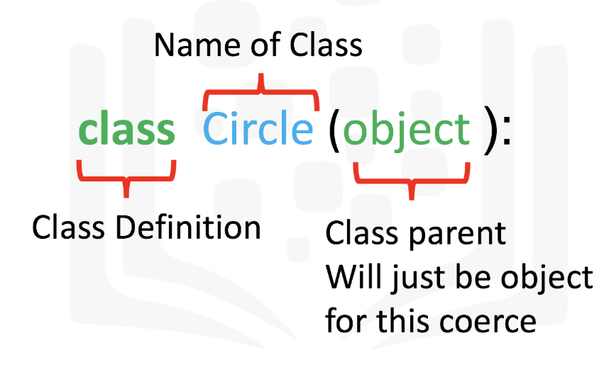
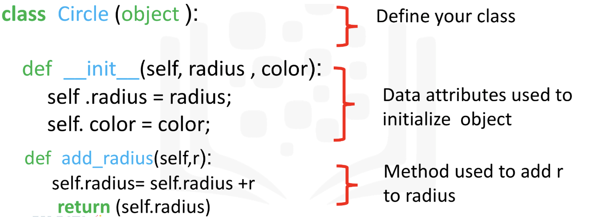

# 3.5 Objects and classes

## **Introduction: Classes and Objects**

Python is an **object-oriented programming (OOP)** language that uses a paradigm centered around objects and classes.

A ***class*** is a blueprint or template for creating objects. It defines the structure and behavior that its objects will have. Think of a class as a cookie cutter and objects as the cookies cut from that template. In Python, you can create classes using the `class` keyword.

When you create a class, you specify the `attributes` (data) and `methods`(functions) that objects of that class will have. `attributes` are defined as variables within the class, and `methods` are defined as functions.

An ***object*** is a fundamental unit in Python that represents a real-world entity or concept.

Objects can be tangible (like a car) or abstract (like a student's grade).

*Every object has two main characteristics:*

- **State**: The `attributes` *or data* that describe the object. For your "Car" object, this might include attributes like "color", "speed", and "fuel level".
- **Behavior**: The actions *or* `methods` that the object can perform. In Python, methods are functions that belong to objects and can change the object's state or perform specific operations.

Once you've defined a class, you can create individual objects (instances) based on that class. Each object is independent and has its own set of attributes and methods. To create an object, you use the class name followed by parentheses, so: "my_car = Car()"

You interact with objects by calling their methods or accessing their attributes using dot notation. For example, if you have a Car object named **my_car**, you can set its color with **my_car.color = "blue"** and accelerate it with **my_car.accelerate()** if there's an accelerate method defined in the class.

## Creating classes

The first step in creating a class is giving it a name. We will create two classes: Circle and Rectangle. Each has their attributes, which are variables. The class Circle has the attribute radius and color, while the Rectangle class has the attribute height and width.


The first step in creating your own class is to use the `class` keyword, then the name of the class. In this course the class parent will always be object:



The next step is a special method called a constructor `__init__`, which is used to initialize the object. The inputs are data attributes. The term `self` contains all the attributes in the set. For example the `self.color` gives the value of the attribute color and `self.radius` will give you the radius of the object. We also have the method `add_radius()` with the parameter `r`, the method adds the value of `r` to the attribute radius. To access the radius we use the syntax `self.radius`. The labeled syntax is summarized in Figure 5:



```python
# Import library to draw circle
import matplotlib.pyplot as plt
%matplotlib inline 

class Circle(object):
    
    # Constructor
    def __init__(self, radius=3, color='blue'):
        self.radius = radius
        self.color = color 
    
    # Method
    def add_radius(self, r):
        self.radius = self.radius + r
        return(self.radius)
    
    # Method
    def drawCircle(self):
        plt.gca().add_patch(plt.Circle((0, 0), radius=self.radius, fc=self.color))
        plt.axis('scaled')
        plt.show() 
```

## **Creating instances of a Class: Objects and Attributes**

An instance of an object is the realisation of a class.


*Three instances of the class Circle, or three objects of type Circle. The colour attribute for the red Circle is the colour red, for the green Circle object the colour attribute is green, and for the yellow Circle the colour attribute is yellow.*

```python
# Create an object RedCircle
RedCircle = Circle(10, 'red')

#We can use the dir command to get a list of the object's methods. Many of them are default Python methods.
dir(RedCircle)

#output: 
['__class__',
 '__delattr__',
 '__dict__',
 '__dir__',
 '__doc__',
 '__eq__',
 '__format__',
 '__ge__',
 '__getattribute__',
 '__getstate__',
 '__gt__',
 '__hash__',
 '__init__',
 '__init_subclass__',
 '__le__',
 '__lt__',
 '__module__',
 '__ne__',
 '__new__',
 '__reduce__',
 '__reduce_ex__',
 '__repr__',
 '__setattr__',
 '__sizeof__',
 '__str__',
 '__subclasshook__',
 '__weakref__',
 **'add_radius',**
 '**color**',
 '**drawCircle**',
 '**radius**']
 
# We can interact with the object's attributes and methods:
 
# Print the object attribute radius
RedCircle.radius 

# Print the object attribute color
RedCircle.color

# Set the object attribute radius
RedCircle.radius = 1
RedCircle.radius

# Call the method drawCircle
RedCircle.drawCircle()

# Use method to change the object attribute radius
print('Radius of object:',RedCircle.radius)
RedCircle.add_radius(2)
print('Radius of object of after applying the method add_radius(2):',RedCircle.radius)
RedCircle.add_radius(5)
print('Radius of object of after applying the method add_radius(5):',RedCircle.radius)

# Create a blue circle with a given radius (the default value for color in the constructor is blue)
BlueCircle = Circle(radius=100)
```