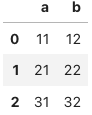
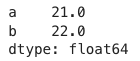
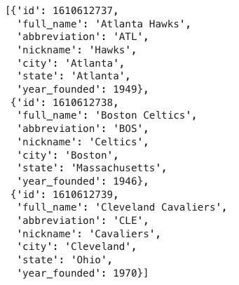
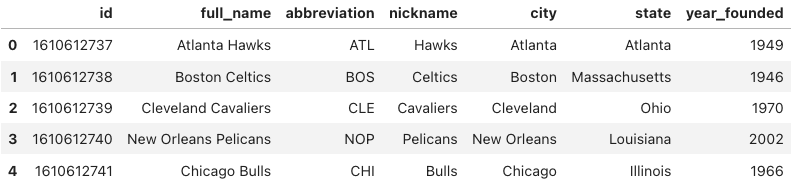
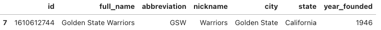
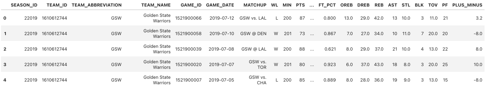
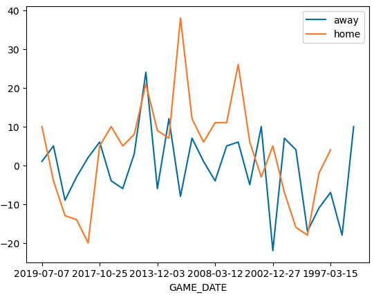

# 5.1 Introducción: Simple APIs

## What is an API?

An API lets two pieces of software talk to each other. Just like a function, you don't have to know how the API works, only its inputs and outputs. An essential type of API is a REST API that allows you to access resources via the internet.

### Example: Pandas is an API

Pandas is actually set of software components, much of which is not even written in Python.


When you create a Pandas object with the DataFrame constructor, in API lingo this is an "instance". The data in the dictionary is passed along to the pandas API. You then use the dataframe to communicate with the API.

```python
import pandas as pd
import matplotlib.pyplot as plt

dict_={'a':[11,21,31],'b':[12,22,32]}
df=pd.DataFrame(dict_)
type(df) #Output: pandas.core.frame.DataFrame
```

When you call the method `head` the dataframe communicates with the API displaying the first few rows of the dataframe.

```python
df.head()
```



When you call the method `mean`, the API will calculate the mean and return the value.

```python
df.mean()
```



## REST APIs

Rest APIs function by sending a **request** that is communicated via HTTP message. The HTTP message usually contains a JSON file. This contains instructions for what operation we would like the service or **resource** to perform. In a similar manner, API returns a **response**, via an HTTP message, also usually contained within a JSON.

In this lab, we will use the [NBA API](../img/https://pypi.org/project/nba-api/?utm_medium=Exinfluencer&utm_source=Exinfluencer&utm_content=000026UJ&utm_term=10006555&utm_id=NA-SkillsNetwork-Channel-SkillsNetworkCoursesIBMDeveloperSkillsNetworkPY0101ENSkillsNetwork19487395-2021-01-01) to determine how well the Golden State Warriors performed against the Toronto Raptors. We will use the API to determine the number of points the Golden State Warriors won or lost by for each game. So if the value is three, the Golden State Warriors won by three points. Similarly it the Golden State Warriors lost by two points the result will be negative two. The API will handle a lot of the details, such a Endpoints and Authentication.

### Example: NBA API

`!pip install nba_api`

We will use the [NBA API](../img/https://pypi.org/project/nba-api/?utm_medium=Exinfluencer&utm_source=Exinfluencer&utm_content=000026UJ&utm_term=10006555&utm_id=NA-SkillsNetwork-Channel-SkillsNetworkCoursesIBMDeveloperSkillsNetworkPY0101ENSkillsNetwork19487395-2021-01-01) to determine how well the Golden State Warriors performed against the Toronto Raptors. The API will handle a lot of the details, such a Endpoints and Authentication.

It's quite simple to use the nba api to make a request for a specific team. We don't require a JSON, all we require is an id. This information is stored locally in the API. We import the module `teams`.

```python
from nba_api.stats.static import teams
import matplotlib.pyplot as plt

def one_dict(list_dict):
    keys=list_dict[0].keys()
    out_dict={key:[] for key in keys}
    for dict_ in list_dict:
        for key, value in dict_.items():
            out_dict[key].append(value)
    return out_dict

# The method get_teams() returns a list of dictionaries.    
nba_teams = teams.get_teams()

#The dictionary key id has a unique identifier for each team as a value. 
#Let's look at the first three elements of the list:
nba_teams[0:3] #Output in the side image
```



To make things easier, we can convert the dictionary to a table. First, we use the function `one dict`, to create a dictionary. We use the common keys for each team as the keys, the value is a list; each element of the list corresponds to the values for each team. We then convert the dictionary to a dataframe, each row contains the information for a different team:

```python
dict_nba_team=one_dict(nba_teams)
df_teams=pd.DataFrame(dict_nba_team)
df_teams.head()
```



Will use the team's nickname to find the unique id, we can see the row that contains the warriors by using the column nickname as follows:

```python
df_warriors=df_teams[df_teams['nickname']=='Warriors']
df_warriors
```



We can use the following line of code to access the first column of the DataFrame:

```python
id_warriors=df_warriors[['id']].values[0][0]
# we now have an integer that can be used to request the Warriors information 
id_warriors #output: 1610612744
```

The function "League Game Finder " will make an API call, it's in the module `stats.endpoints`. 

The parameter `team_id_nullable` is the unique ID for the warriors. Under the hood, the NBA API is making a HTTP request. The information requested is provided and is transmitted via an HTTP response this is assigned to the object `game finder`. The game finder object has a method `get_data_frames()`, that returns a dataframe. If we view the dataframe, we can see it contains information about all the games the Warriors played. 

```python
from nba_api.stats.endpoints import leaguegamefinder

gamefinder = leaguegamefinder.LeagueGameFinder(team_id_nullable=id_warriors)
gamefinder.get_json()
games = gamefinder.get_data_frames()[0]
games.head()
```

You can download the dataframe from the API call for Golden State :

```python
import requests

filename = "https://s3-api.us-geo.objectstorage.softlayer.net/cf-courses-data/CognitiveClass/PY0101EN/Chapter%205/Labs/Golden_State.pkl"

def download(url, filename):
    response = requests.get(url)
    if response.status_code == 200:
        with open(filename, "wb") as f:
            f.write(response.content)

download(filename, "Golden_State.pkl")

file_name = "Golden_State.pkl"
games = pd.read_pickle(file_name)
games.head()
```



We can create two dataframes, one for the games that the Warriors faced the raptors at home, and the second for away games.

```python
games_home=games[games['MATCHUP']=='GSW vs. TOR']
games_away=games[games['MATCHUP']=='GSW @ TOR']
```

We can calculate the mean for the column `PLUS_MINUS` for the dataframes `games_home` and  `games_away`:

```python
games_home['PLUS_MINUS'].mean() #3.730769230769231
games_away['PLUS_MINUS'].mean() #-0.6071428571428571
```

We can plot out the `PLUS MINUS` column for the dataframes `games_home` and  `games_away`. We see the warriors played better at home:

```python
fig, ax = plt.subplots()

games_away.plot(x='GAME_DATE',y='PLUS_MINUS', ax=ax)
games_home.plot(x='GAME_DATE',y='PLUS_MINUS', ax=ax)
ax.legend(["away", "home"])
plt.show()
```

