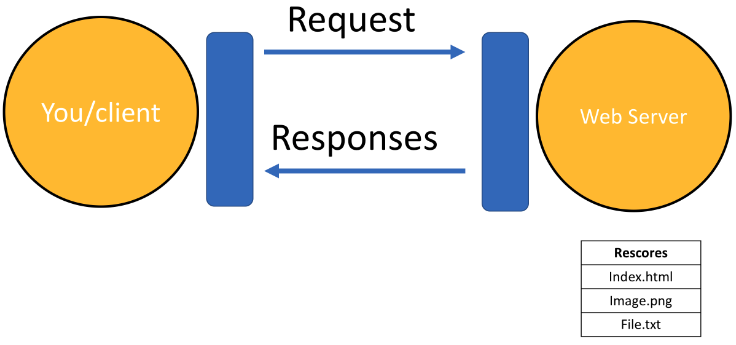
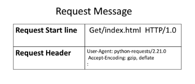
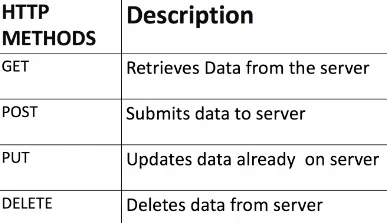
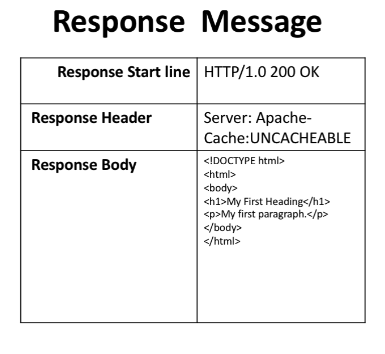
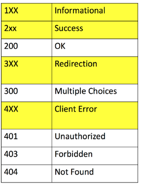
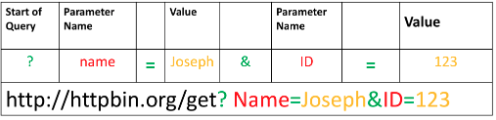

# 5.2 REST APIs & HTTP request

## Overview of HTTP

When you, the **client**, use a web page, your browser sends an **HTTP** request to the **server** where the page is hosted. The server tries to find the desired **resource**, typically the default `index.html`. If your request is successful, the server will send the object to the client in an **HTTP response**. This response includes information such as the type of the **resource**, the length of the **resource**, and other relevant details.

The figure below represents the process. The circle on the left represents the client, and the circle on the right represents the web server. The table under the web server symbolizes a list of resources stored on the server, such as an `HTML` file, a `png` image, and a `txt` file.

The **HTTP** protocol facilitates the exchange of information on the web, including webpages, images, and other resources. In this lab, we will provide an overview of the Requests library for interacting with the `HTTP` protocol.



### **Uniform Resource Locator: URL**

A Uniform Resource Locator (URL) is the most popular way to find resources on the web. A URL can be divided into three parts:

1. **Scheme**: This is the protocol. For this lab, it will always be `http://`.
2. **Internet Address or Base URL**: This is used to find the location. Examples include `www.ibm.com` and `www.gitlab.com`.
3. **Route**: This is the location on the web server. For example: `/images/IDSNlogo.png`.

> You may also hear the term Uniform Resource Identifier (URI), URL are actually a subset of URIs. Another popular term is endpoint, this is the URL of an operation provided by a Web server.
> 

### Request

The process can be divided into the **Request** and **Response** phases. The request using the GET method is partially illustrated below:

In the start line, we have the `GET` method, which is an **HTTP** method, along with the location of the resource (`/index.html`) and the **HTTP** version. The Request Header provides additional information along with the **HTTP** request.





When an **HTTP** request is made, an **HTTP** method is sent. This method tells the server what action to perform. The image in the right shows a list of several **HTTP** methods. 

### Response

The figure represents the response. The response start line includes the version number (`HTTP/1.0`), a status code (`200`), which indicates success, and a descriptive phrase (`OK`). The response header provides useful information, and the response body contains the requested file, such as an `HTML` document. It should also be noted that some requests include headers.



Some examples of status codes are shown in the table. The prefix indicates the class (highlighted in yellow), while the actual status codes are displayed in white. 

For more detailed descriptions, check out the following [link](../img/https://developer.mozilla.org/en-US/docs/Web/HTTP/Status?utm_medium=Exinfluencer&utm_source=Exinfluencer&utm_content=000026UJ&utm_term=10006555&utm_id=NA-SkillsNetwork-Channel-SkillsNetworkCoursesIBMDeveloperSkillsNetworkPY0101ENSkillsNetwork19487395-2021-01-01).



## Requests in Python

Requests is a Python library that allows you to send `HTTP/1.1` requests easily. You can import the library as shown below:

```python
import requests

# a GET request to ibm
url='https://www.ibm.com/'
r=requests.get(url)

# To view the status code:
r.status_code

# To view the request headers:
print(r.request.headers)

# To view the request body (as there is no body for a get request we get None)
print("request body:", r.request.body)

# To view HTTP response header:
header=r.headers
print(r.headers)

# We can obtain the date the request was sent using the key 'Date'
header['date']

# And 'Content-Type' will indicate the type of data:
header['Content-Type']

# To check the encoding: 
r.encoding

# As the content type is text/html, we can use the 
# attribute text to display the HTML in the body.
# Here the code to display the first 100 characters:
r.text[0:100]

```

### Examples:

- **Accessing an image:** 
An image is a response object that contains the image as a [bytes-like object](../img/https://docs.python.org/3/glossary.html?utm_medium=Exinfluencer&utm_source=Exinfluencer&utm_content=000026UJ&utm_term=10006555&utm_id=NA-SkillsNetwork-Channel-SkillsNetworkCoursesIBMDeveloperSkillsNetworkPY0101ENSkillsNetwork19487395-2021-01-01#term-bytes-like-object). Therefore, it must be saved using a file object. To do this, we first specify the **file path and name**.
    
    ```python
    path=os.path.join(os.getcwd(),'image.png')
    ```
    
    We save the file. To access the body of the response, we use the attribute `content`. Then, we save it using the `open` function and the `write` method.
    
    ```python
    from PIL import Image
    
    with open(path,'wb') as f:
        f.write(r.content)
        
    # To view the image:
    Image.open(path)
    ```
    
- **Accessing a file:**
Given the URL: [`https://cf-courses-data.s3.us.cloud-object-storage.appdomain.cloud/IBMDeveloperSkillsNetwork-PY0101EN-SkillsNetwork/labs/Module 5/data/Example1.txt](../img/https://cf-courses-data.s3.us.cloud-object-storage.appdomain.cloud/IBMDeveloperSkillsNetwork-PY0101EN-SkillsNetwork/labs/Module%205/data/Example1.txt)`
These would be the commands to download the txt file:
    
    ```python
    url='https://cf-courses-data.s3.us.cloud-object-storage.appdomain.cloud/IBMDeveloperSkillsNetwork-PY0101EN-SkillsNetwork/labs/Module%205/data/Example1.txt'
    path=os.path.join(os.getcwd(),'example1.txt')
    r=requests.get(url)
    with open(path,'wb') as f:
        f.write(r.content)
    ```
    

## **GET Request with URL Parameters**

You can use the **GET** method to modify the results of your query, such as retrieving data from an API. We send a **GET** request to the server. As before, we have the **Base URL**, and in the **Route**, we append `/get`, which indicates that we would like to perform a **GET** request.

```python
url_get='http://httpbin.org/get'
```

A [query string](../img/https://en.wikipedia.org/wiki/Query_string?utm_medium=Exinfluencer&utm_source=Exinfluencer&utm_content=000026UJ&utm_term=10006555&utm_id=NA-SkillsNetwork-Channel-SkillsNetworkCoursesIBMDeveloperSkillsNetworkPY0101ENSkillsNetwork19487395-2021-01-01) is a part of a Uniform Resource Locator (URL) that sends additional information to the web server. The query begins with a `?`, followed by a series of parameter-value pairs, as shown in the table below. The first parameter name is `name`, with the value `Joseph`. The second parameter name is `ID`, with the value `123`. Each parameter-value pair is separated by an equals sign (`=`), and the pairs are separated by an ampersand (`&`).



```python
# To create a Query string, add a dictionary. 
# The keys are the parameter names and the values are the value of the Query string.

payload={"name":"Joseph","ID":"123"}

# Then pass the dictionary payload to the params parameter of the get() function:
r=requests.get(url_get,params=payload)
r.url #we can print the url and see the name and values
print("request body:", r.request.body) #There is no request body
print(r.status_code) #To print the status code
print(r.text) #To print the response as text
r.headers['Content-Type'] #To view content type

# As the content type is in JSON format, we can convert it to a python dict by:
r.json()

# The key args has the name and values
r.json()['args']
```

## POST Request

Like a `GET` request, a `POST` is used to send data to a server, but the `POST` request sends the data in the request body. To send the `POST` request in Python, we change the route to `POST` in the **URL**.

```python
url_post='http://httpbin.org/post'
```

This endpoint will expect data as a file or as a form. A form is convenient way to configure an HTTP request to send data to a server.

To make a `POST` request we use the `post()` function, the variable `payload` is passed to the parameter `data`:

```python
r_post=requests.post(url_post,data=payload)

# Comparing the URL from the response object of the GET and POST requests 
# we see the POST request has no name or value pairs in the URL 
# but, unlike the GET request, it does have information in the body.

print("POST request URL:",r_post.url )
print("GET request URL:",r.url)

print("POST request body:",r_post.request.body)
print("GET request body:",r.request.body)

#We can view the form as well:
r_post.json()['form']
```