# 5.4 Working with different file formats

# Data Engineering

**Data engineering** is one of the most critical and foundational skills in any data scientist’s toolkit. There are several steps in the **Data Engineering process**.

1. **Extract** - Data extraction is getting data from multiple sources. Ex. Data extraction from a website using Web scraping or gathering information from the data that are stored in different formats(JSON, CSV, XLSX etc.).
2. **Transform** - Transforming the data means removing the data that we don't need for further analysis and converting the data in the format that all the data from the multiple sources is in the same format.
3. **Load** - Loading the data inside a data warehouse. Data warehouse essentially contains large volumes of data that are accessed to gather insights.

# Different file formats

In the real-world, people rarely get neat tabular data. Thus, it is mandatory for any data scientist (or data engineer) to be aware of different file formats, common challenges in handling them and the best, most efficient ways to handle this data in real life. We have reviewed some of this content in other modules.

A file format is a standard way in which information is encoded for storage in a file. First, the file format specifies whether the file is a binary or ASCII file. Second, it shows how the information is organized. For example, the comma-separated values (CSV) file format stores tabular data in plain text.

To identify a file format, you can usually look at the file extension to get an idea. For example, a file saved with name "Data" in "CSV" format will appear as **Data.csv**. There are various formats for a dataset: .csv, .json, .xlsx etc. 

## Comma-separated values (CSV) file format

The **Comma-separated values** file format falls under a spreadsheet file format.

In a spreadsheet file format, data is stored in cells. Each cell is organized in rows and columns. A column in the spreadsheet file can have different types. For example, a column can be of string type, a date type, or an integer type. Each line in CSV file represents an observation, or commonly called a record. Each record may contain one or more fields which are separated by a comma.

The **Pandas** Library is a useful tool that enables us to read various datasets into a Pandas data frame. We use **pandas.read_csv()** function to read the csv file. In the parentheses, we put the file path along with a quotation mark as an argument, so that pandas will read the file into a data frame from that address. The file path can be either a URL or your local file address.

```python
import piplite
await piplite.install(['seaborn', 'lxml', 'openpyxl'])

import pandas as pd
from pyodide.http import pyfetch

filename = "https://cf-courses-data.s3.us.cloud-object-storage.appdomain.cloud/IBMDeveloperSkillsNetwork-PY0101EN-SkillsNetwork/labs/Module%205/data/addresses.csv"

async def download(url, filename):
    response = await pyfetch(url)
    if response.status == 200:
        with open(filename, "wb") as f:
            f.write(await response.bytes())

await download(filename, "addresses.csv")

df = pd.read_csv("addresses.csv", header=None)

df # Output:
```

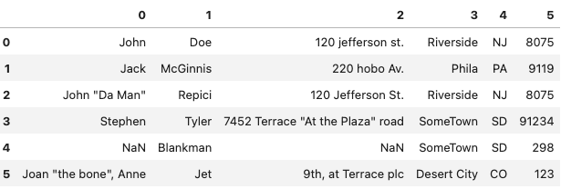

```python
# Adding column name to the DataFrame
df.columns =['First Name', 'Last Name', 'Location ', 'City','State','Area Code']

df # Output:
```

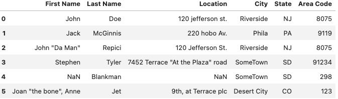

```python
# Selecting a single column
df["First Name"]

df # Output:
```

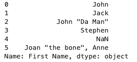

```python
# Selecting multiple columns
df = df[['First Name', 'Last Name', 'Location ', 'City','State','Area Code']]

df # Output:
```

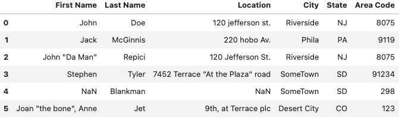

### **Selecting rows using .iloc and .loc**

- **`loc()`:** it is a label based data selecting method which means that we have to pass the name of the row or column which we want to select.
    
    ```python
    # To select the first row
    df.loc[0]
    
    # To select the 0th,1st and 2nd row of "First Name" column only
    df.loc[[0,1,2], "First Name" ]
    ```
    
- **`iloc()`:** it is an indexed based selecting method which means that we have to pass integer index in the method to select specific row/column.
    
    ```python
    # To select the 0th,1st and 2nd row of "First Name" column only
    df.iloc[[0,1,2], 0]
    ```
    

### Transform function in Pandas

Python's Transform function returns a self-produced dataframe with transformed values after applying the function specified in its parameter.

```python
#import library
import pandas as pd
import numpy as np

#creating a dataframe
df=pd.DataFrame(np.array([[1, 2, 3], [4, 5, 6], [7, 8, 9]]), columns=['a', 'b', 'c'])
df

#applying the transform function to add 10 to each element in the dataframe
df = df.transform(func = lambda x : x + 10)
df

#use transform function to find the square root to each element of the dataframe
result = df.transform(func = ['sqrt'])
```


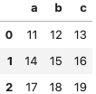

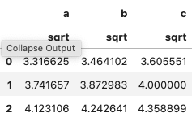

## JSON file format

**JSON (JavaScript Object Notation)** is a lightweight data-interchange format. It is easy for humans to read and write.

JSON is built on two structures:

1. A collection of name/value pairs. In various languages, this is realized as an object, record, struct, dictionary, hash table, keyed list, or associative array.
2. An ordered list of values. In most languages, this is realized as an array, vector, list, or sequence.

JSON is a language-independent data format. It was derived from JavaScript, but many modern programming languages include code to generate and parse JSON-format data. It is a very common data format with a diverse range of applications.

Python supports JSON through a built-in package called **json**. To use this feature, we import the json package in Python script.

Writing JSON to a file is usually called **serialization**. It is the process of converting an object into a special format which is suitable for transmitting over the network or storing in file or database.

To handle the data flow in a file, the JSON library in Python use the **dump()** or **dumps()** function to convert the Python objects into their respective JSON object. This makes it easy to write data to files.

```python
import json
import json

person = {
    'first_name' : 'Mark',
    'last_name' : 'abc',
    'age' : 27,
    'address': {
        "streetAddress": "21 2nd Street",
        "city": "New York",
        "state": "NY",
        "postalCode": "10021-3100"
    }
}
```

### Serialization using dump() function

**json.dump()** method can be used for writing to JSON file.

Syntax: json.dump(dict, file_pointer)

Parameters:

1. **dictionary** – name of the dictionary which should be converted to JSON object.
2. **file pointer** – pointer of the file opened in write or append mode.

```python
with open('person.json', 'w') as f:  # writing JSON object
    json.dump(person, f)
```

### Serialization using dumps() function

**json.dumps()** that helps in converting a dictionary to a JSON object.

It takes two parameters:

1. **dictionary** – name of the dictionary which should be converted to JSON object.
2. **indent** – defines the number of units for indentation

```python
# Serializing json  
json_object = json.dumps(person, indent = 4) 
  
# Writing to sample.json 
with open("sample.json", "w") as outfile: 
    outfile.write(json_object) 

print(json_object)
```

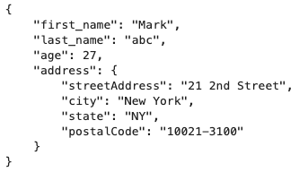

### Deserialization: Reading JSON to a File

it is the reverse of serialization. It converts the special format returned by the serialization back into a usable object.

### Using json.load()

The JSON package has json.load() function that loads the json content from a json file into a dictionary.

It takes one parameter: A file pointer that points to a JSON file.

```python
import json 
  
# Opening JSON file 
with open('sample.json', 'r') as openfile: 
  
    # Reading from json file 
    json_object = json.load(openfile) 
  
print(json_object) #output: {'first_name': 'Mark', 'last_name': 'abc', 'age': 27, 'address': {'streetAddress': '21 2nd Street', 'city': 'New York', 'state': 'NY', 'postalCode': '10021-3100'}}

print(type(json_object)) #output: <class 'dict'>
```

## XLSX file format

**XLSX** is a Microsoft Excel Open XML file format. It is another type of Spreadsheet file format.

In XLSX data is organized under the cells and columns in a sheet. For loading the data you can use the Pandas library in python.

```python
import pandas as pd

# Not needed unless you're running locally
# import urllib.request
# urllib.request.urlretrieve("https://cf-courses-data.s3.us.cloud-object-storage.appdomain.cloud/IBMDeveloperSkillsNetwork-PY0101EN-SkillsNetwork/labs/Module%205/data/file_example_XLSX_10.xlsx", "sample.xlsx")

filename = "https://cf-courses-data.s3.us.cloud-object-storage.appdomain.cloud/IBMDeveloperSkillsNetwork-PY0101EN-SkillsNetwork/labs/Module%205/data/file_example_XLSX_10.xlsx"

async def download(url, filename):
    response = await pyfetch(url)
    if response.status == 200:
        with open(filename, "wb") as f:
            f.write(await response.bytes())

await download(filename, "file_example_XLSX_10.xlsx")

df = pd.read_excel("file_example_XLSX_10.xlsx")

df #output:
```

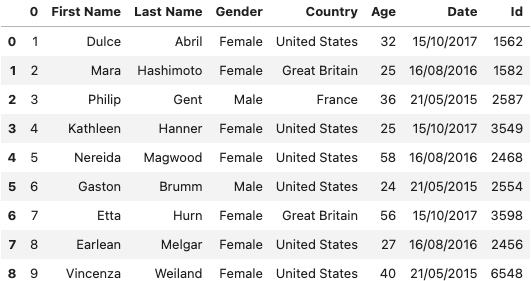

## XML file format

**XML is also known as Extensible Markup Language**. As the name suggests, it is a markup language. It has certain rules for encoding data. XML file format is a human-readable and machine-readable file format.

Pandas does not include any methods to read and write XML files. Here, we will take a look at how we can use other modules to read data from an XML file, and load it into a Pandas DataFrame.

### **Writing with xml.etree.ElementTree**

The **xml.etree.ElementTree** module comes built-in with Python. It provides functionality for parsing and creating XML documents. **ElementTree** represents the XML document as a tree. We can move across the document using nodes which are elements and sub-elements of the XML file.

For more information please read the [xml.etree.ElementTree](../img/https://docs.python.org/3/library/xml.etree.elementtree.html?utm_medium=Exinfluencer&utm_source=Exinfluencer&utm_content=000026UJ&utm_term=10006555&utm_id=NA-SkillsNetwork-Channel-SkillsNetworkCoursesIBMDeveloperSkillsNetworkPY0101ENSkillsNetwork19487395-2021-01-01) documentation.

```python
import xml.etree.ElementTree as ET

# create the file structure
employee = ET.Element('employee')
details = ET.SubElement(employee, 'details')
first = ET.SubElement(details, 'firstname')
second = ET.SubElement(details, 'lastname')
third = ET.SubElement(details, 'age')
first.text = 'Shiv'
second.text = 'Mishra'
third.text = '23'

# create a new XML file with the results
mydata1 = ET.ElementTree(employee)
# myfile = open("items2.xml", "wb")
# myfile.write(mydata)
with open("new_sample.xml", "wb") as files:
    mydata1.write(files)
```

### **Reading with xml.etree.ElementTree**

Let's have a look at a one way to read XML data and put it in a Pandas DataFrame. You can see the XML file in the Notepad of your local machine.

```python
# Not needed unless running locally
# !wget https://cf-courses-data.s3.us.cloud-object-storage.appdomain.cloud/IBMDeveloperSkillsNetwork-PY0101EN-SkillsNetwork/labs/Module%205/data/Sample-employee-XML-file.xml

import xml.etree.ElementTree as etree

filename = "https://cf-courses-data.s3.us.cloud-object-storage.appdomain.cloud/IBMDeveloperSkillsNetwork-PY0101EN-SkillsNetwork/labs/Module%205/data/Sample-employee-XML-file.xml"

async def download(url, filename):
    response = await pyfetch(url)
    if response.status == 200:
        with open(filename, "wb") as f:
            f.write(await response.bytes())

await download(filename, "Sample-employee-XML-file.xml")
```

You would need to firstly parse an XML file and create a list of columns for data frame, then extract useful information from the XML file and add to a pandas data frame.

Here is a sample code that you can use.:

```python
# Parse the XML file
tree = etree.parse("Sample-employee-XML-file.xml")

# Get the root of the XML tree
root = tree.getroot()

# Define the columns for the DataFrame
columns = ["firstname", "lastname", "title", "division", "building", "room"]

# Initialize an empty DataFrame
datatframe = pd.DataFrame(columns=columns)

# Iterate through each node in the XML root
for node in root:
    # Extract text from each element
    firstname = node.find("firstname").text
    lastname = node.find("lastname").text
    title = node.find("title").text
    division = node.find("division").text
    building = node.find("building").text
    room = node.find("room").text
    
    # Create a DataFrame for the current row
    row_df = pd.DataFrame([[firstname, lastname, title, division, building, room]], columns=columns)
    
    # Concatenate with the existing DataFrame
    datatframe = pd.concat([datatframe, row_df], ignore_index=True)

datatframe #output:
```

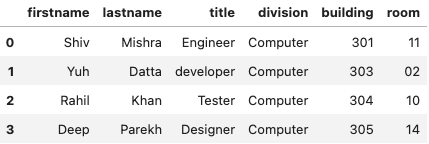

### Reading xml file using pandas.read_xml function

We can also read the downloaded xml file using the read_xml function present in the pandas library which returns a Dataframe object.

For more information read the [pandas.read_xml](../img/https://pandas.pydata.org/pandas-docs/dev/reference/api/pandas.read_xml.html?utm_medium=Exinfluencer&utm_source=Exinfluencer&utm_content=000026UJ&utm_term=10006555&utm_id=NA-SkillsNetwork-Channel-SkillsNetworkCoursesIBMDeveloperSkillsNetworkPY0101ENSkillsNetwork19487395-2021-01-01#pandas-read-xml) documentation.

```python
# Herein xpath we mention the set of xml nodes to be considered for migrating  to the dataframe which in this case is details node under employees.
df=pd.read_xml("Sample-employee-XML-file.xml", xpath="/employees/details") 
```

**Save Data**

Correspondingly, Pandas enables us to save the dataset to csv by using the **dataframe.to_csv()** method, you can add the file path and name along with quotation marks in the parentheses.

For example, if you would save the dataframe df as **employee.csv** to your local machine, you may use the syntax below:

```python
datatframe.to_csv("employee.csv", index=False)
```

We can also read and save other file formats, we can use similar functions to **`pd.read_csv()`** and **`df.to_csv()`** for other data formats. The functions are listed in the following table:

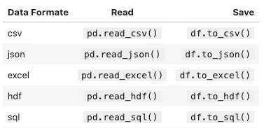

## Binary file format

"Binary" files are any files where the format isn't made up of readable characters. It contain formatting information that only certain applications or processors can understand. While humans can read text files, binary files must be run on the appropriate software or processor before humans can read them.

Binary files can range from image files like JPEGs or GIFs, audio files like MP3s or binary document formats like Word or PDF.

Let's see how to read an **Image** file.

### Reading the Image file

Python supports very powerful tools when it comes to image processing. Let's see how to process the images using the **PIL** library.

**PIL** is the Python Imaging Library which provides the python interpreter with image editing capabilities.

```python
# importing PIL 
from PIL import Image 

# Uncomment if running locally
# import urllib.request
# urllib.request.urlretrieve("https://hips.hearstapps.com/hmg-prod.s3.amazonaws.com/images/dog-puppy-on-garden-royalty-free-image-1586966191.jpg", "dog.jpg")

filename = "https://hips.hearstapps.com/hmg-prod.s3.amazonaws.com/images/dog-puppy-on-garden-royalty-free-image-1586966191.jpg"

async def download(url, filename):
    response = await pyfetch(url)
    if response.status == 200:
        with open(filename, "wb") as f:
            f.write(await response.bytes())

await download(filename, "./dog.jpg")

# Read image 
img = Image.open('./dog.jpg','r') 
  
# Output Images 
img.show()
```

# Data Analysis

In this section, you will learn how to approach data acquisition in various ways and obtain necessary insights from a dataset. 

## Case study: the Diabetes Dataset

The **Diabetes Dataset** is an online source and it is in CSV (comma separated value) format. 

- **Context:** This dataset is originally from the **National Institute of Diabetes and Digestive and Kidney Diseases**. The objective of the dataset is to diagnostically predict whether or not a patient has diabetes, based on certain diagnostic measurements included in the dataset. Several constraints were placed on the selection of these instances from a larger database. In particular, all patients here are females at least 21 years of age of Pima Indian heritage.
- **Content:** The datasets consists of several medical predictor variables and one target variable, Outcome. Predictor variables includes the number of pregnancies the patient has had, their BMI, insulin level, age, and so on. We have 768 rows and 9 columns. The first 8 columns represent the features and the last column represent the target/label.

```python
# Import pandas library
import pandas as pd

filename = "https://cf-courses-data.s3.us.cloud-object-storage.appdomain.cloud/IBMDeveloperSkillsNetwork-PY0101EN-SkillsNetwork/labs/Module%205/data/diabetes.csv"

async def download(url, filename):
    response = await pyfetch(url)
    if response.status == 200:
        with open(filename, "wb") as f:
            f.write(await response.bytes())

await download(filename, "diabetes.csv")
df = pd.read_csv("diabetes.csv")

# show the first 5 rows using dataframe.head() method
print("The first 5 rows of the dataframe") 
df.head(5)
```

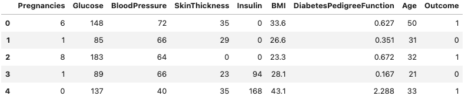

```python
#To view the dimensions of the dataframe:
df.shape #outcome: (768, 9)
```

## Statistical Overview of the dataset:

```python
df.info()
# This method prints information about a DataFrame including the index dtype 
# and columns, non-null values and memory usage.

df.describe()
# Pandas describe() is used to view some basic statistical details like percentile,
# mean, standard deviation, etc. of a data frame or a series of numeric values. 
# When this method is applied to a series of strings, it returns a different output
```

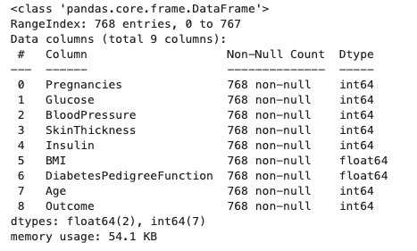

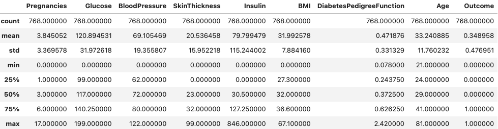

### **Identify and handle missing values[¶](../img/https://cf-courses-data.static.labs.skills.network/jupyterlite/2.5.5/lab/index.html?mode=learn&env_type=jupyterlite&notebook_url=https%3A%2F%2Fcf-courses-data.static.labs.skills.network%2FIBMDeveloperSkillsNetwork-PY0101EN-SkillsNetwork%2Flabs%2Fjupyterlite%2Ffiles%2FModule_5%2FPY0101EN-5.4_WorkingWithDifferentFileTypes-20230719-1689724800.jupyterlite.ipynb&file_path=PY0101EN%2Fjupyterlite%2Ffiles%2FModule+5%2FPY0101EN-5+4_WorkingWithDifferent.ipynb#Identify-and-handle-missing-values)**

We use Python's built-in functions to identify these missing values. There are two methods to detect missing data:

- **`.isnull()`**
- **`.notnull()`**

The output is a boolean value indicating whether the value that is passed into the argument is in fact missing data.

```python
missing_data = df.isnull()
missing_data.head(5)

# "True" standos for missing value, "False" fornot missing value
```

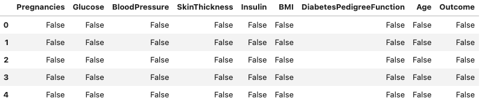

### Count missing values in each column

Using a for loop in Python, we can quickly figure out the number of missing values in each column. As mentioned above, "True" represents a missing value, "False" means the value is present in the dataset. In the body of the for loop the method ".value_counts()" counts the number of "True" values.

```python
for column in missing_data.columns.values.tolist():
    print(column)
    print (missing_data[column].value_counts())
    print("")    
```

### Correct data format

Check all data is in the correct format (int, float, text or other).

In Pandas, we use

**.dtype()** to check the data type

**.astype()** to change the data type

Numerical variables should have type **'float'** or **'int'**.

```python
df.dtypes
```

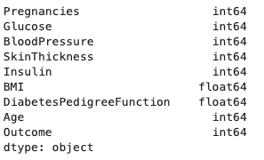

## Visualization

**Visualization** is one of the best way to get insights from the dataset. **Seaborn** and **Matplotlib** are two of Python's most powerful visualization libraries.

```python
# import libraries
import matplotlib.pyplot as plt
import seaborn as sns

labels= 'Not Diabetic','Diabetic'
plt.pie(df['Outcome'].value_counts(),labels=labels,autopct='%0.02f%%')
plt.legend()
plt.show()
```

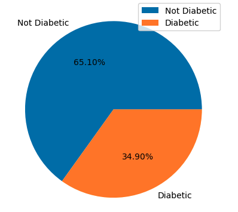