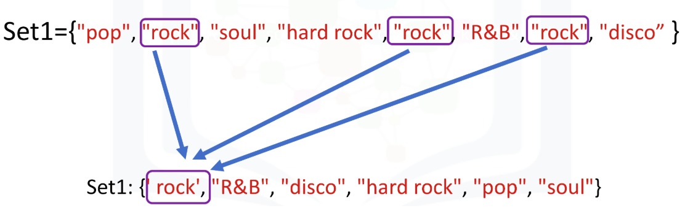
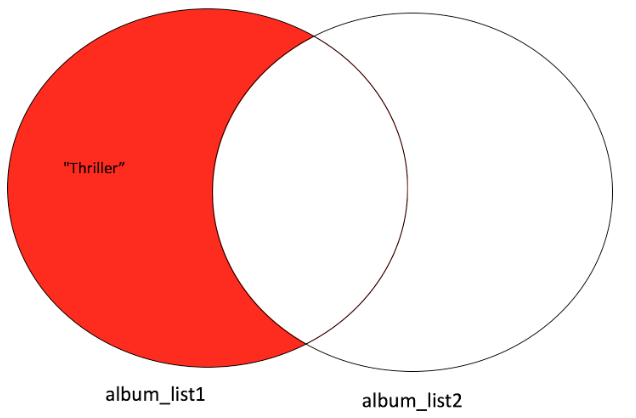
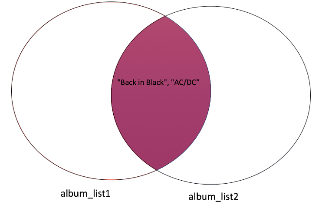
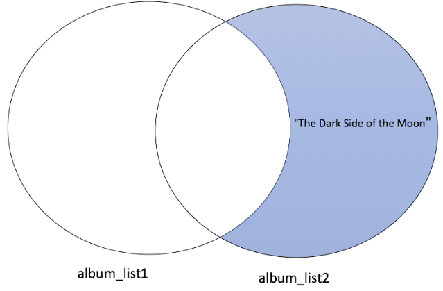
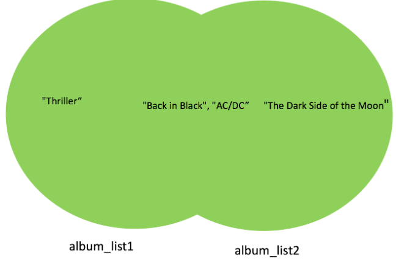

# 2.4 Sets {} (no duplicates)

- A set is a unique collection of objects in Python. You can denote a set with a pair of curly brackets **{}**. Python will automatically remove duplicate items:
    
    
    
    This figure illustrates the process of mapping.
    

```python
# Convert list to set (**typecasting**)
album_list = [ "Michael Jackson", "Thriller", 1982, "00:42:19", \
              "Pop, Rock, R&B", 46.0, 65, "30-Nov-82", None, 10.0]
album_set = set(album_list)             
album_set

**# Set Operations**
A = set(["Thriller", "Back in Black", "AC/DC"])
A #output: {'AC/DC', 'Back in Black', 'Thriller'}

# Add element to set using **add() method**:
A.**add**("NSYNC") #output: {'AC/DC', 'Back in Black', 'NSYNC', 'Thriller'}

# Remove the element from set with **remove() method**:
A.**remove**("NSYNC") #output: {'AC/DC', 'Back in Black', 'Thriller'}

# **Verify** if the element is in the set
"AC/DC" **in** A #output: True
```

- With sets you can check the difference between sets, as well as the symmetric **difference**, **intersection**, and **union**:
    
    
    
    
    Difference
    
    
    
    Intersection
    
    
    
    Difference
    
    
    
    Union
    

```python
# **Sets Logic operations**
album_set1 = set(["Thriller", 'AC/DC', 'Back in Black'])
album_set2 = set([ "AC/DC", "Back in Black", "The Dark Side of the Moon"])

# Find the **intersections**
intersection = album_set1 **&** album_set2
intersection #output: {'AC/DC', 'Back in Black'}

# You can also use **intersection** **method** 
album_set1.intersection(album_set2) #output: {'AC/DC', 'Back in Black'}

# Find the elements that are only contained in one set **using difference method**
album_set1.**difference**(album_set2) #output: {'Thriller'}
album_set2.**difference**(album_set1) #output: {'The Dark Side of the Moon'}

# Find the union of two sets using the **union method**
album_set1.**union**(album_set2) #output:{'AC/DC', 'Back in Black', 'The Dark Side of the Moon', 'Thriller'}

****# Check if superset
album_set1.**issuperset**(album_set2) #output: False
album_set1.**issuperset**({"Back in Black", "AC/DC"}) #output: True

# Check if subset
album_set2.**issubset**(album_set1) #output: False
set({"Back in Black", "AC/DC"}).**issubset**(album_set1) #output: True 

****
```