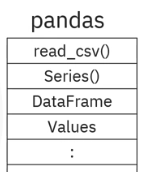
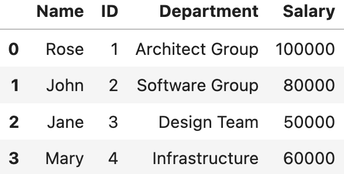
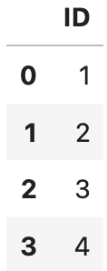
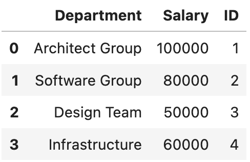
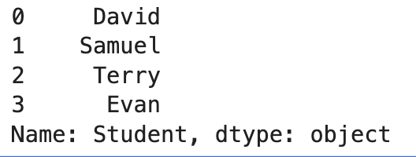
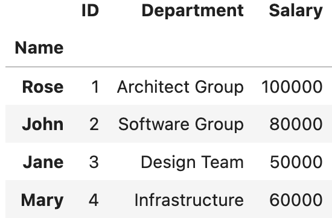
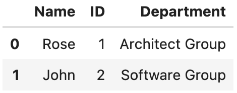
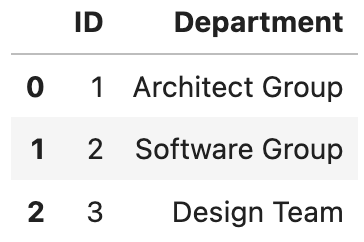
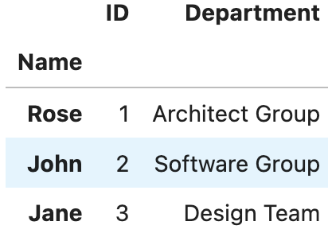

# 4.2 Pandas

## Introduction

Pandas is a popular open-source data manipulation and analysis library for the Python programming language. It provides a powerful and flexible set of tools for working with structured data, making it a fundamental tool for data scientists, analysts, and engineers.

### Key features and functionalities

### Data structures

Pandas offers two primary data structures: **DataFrames and Series**.

- A **DataFrame** is a two-dimensional, size-mutable, and potentially heterogeneous tabular data structure with labeled axes (rows and columns).
    - A Pandas DataFrame will be created by loading the datasets from existing storage.
    - Storage can be SQL Database, CSV file, Excel file, etc.
    - It can also be created from the lists, dictionaries, and from a list of dictionaries.
- A **Series** is a one-dimensional labeled array, essentially a single column or row of data. Ithas two main components:
    - An array of actual data.
    - An associated array of indexes or data labels.
    
    The index is used to access individual data values. You can also get a column of a dataframe as a **Series**. You can think of a Pandas series as a 1-D dataframe.
    

### **Data Import and Export**

Pandas makes it easy to read data from various sources, including CSV files, Excel spreadsheets, SQL databases, and more. It can also export data to these formats, enabling seamless data exchange.

### **Data Merging and Joining**

You can combine multiple DataFrames using methods like merge and join, similar to SQL operations, to create more complex datasets from different sources.

### Efficient Indexing

Pandas provides efficient indexing and selection methods, allowing you to access specific rows and columns of data quickly.

### **Custom Data Structures**:

You can create custom data structures and manipulate data in ways that suit your specific needs, extending Pandas' capabilities.

## Importing Pandas and Loading data

```python
import pandas
# After importing the library, you have access to a large  
# number of pre-built classes and functions, like read_csv(), 
# DataFrame...
```



```python
import pandas as pd
# Use the as statement to shorten the name of the library
# pd is the standard abbreviation
```

### `read_csv()`

It is a **pandas module-level function** used to load a CSV file into a pandas DataFrame. It reads the file, infers the structure, and allows for further options like specifying column names, handling missing values, or customizing the delimiter.

```python
import pandas as pd
csv_path='file1.csv'
df = pd.read_csv(csv_path)
```

## **Selecting data with Pandas: DataFrame and Series**

### Pandas Series

A Series is a one-dimensional array-like structure that holds data along with an associated index.

**Characteristics**:

- It is essentially a column of data.
- Has only one axis: a single list of values with an index.
- Can hold data of any type (integers, strings, floats, etc.).
- Think of it as similar to a Python list or a dictionary where keys are the index.

```python
import pandas as pd

# Creating a Series
s = pd.Series([10, 20, 30, 40], index=["a", "b", "c", "d"])
print(s)
```

```markdown
Output: 

a    10
b    20
c    30
d    40
dtype: int64
```

### Pandas DataFrame

A DataFrame is a two-dimensional, tabular data structure that can hold multiple Series as columns.

**Characteristics**:

- Has two axes: rows and columns.
- Each column in a DataFrame is a Series, but a DataFrame can contain multiple Series of different data types.
- Often used to represent structured data, such as a table in a database or a spreadsheet.

```python
# Creating a DataFrame
df = pd.DataFrame({
    "Name": ["Alice", "Bob", "Charlie"],
    "Age": [25, 30, 35],
    "Salary": [50000, 60000, 70000]
})
print(df)
```

```markdown
Output:

     Name  Age  Salary
0   Alice   25   50000
1     Bob   30   60000
2  Charlie   35   70000

```

### Creating a DataFrame from a dictionary:

```python
# import the Pandas Library
import pandas as pd

#Define a dictionary 'x'
x = {'Name': ['Rose','John', 'Jane', 'Mary'], 'ID': [1, 2, 3, 4], 'Department': ['Architect Group', 'Software Group', 'Design Team', 'Infrastructure'], 
      'Salary':[100000, 80000, 50000, 60000]}

#casting the dictionary to a DataFrame
df = pd.DataFrame(x)
```



### Column selection

```python
# Retrieving the "ID" column and assigning it to a variable x
x = df[['ID']]
x

# check the type of x
type(x) #output: pandas.core.frame.DataFrame

# Access to multiple columns
z = df[['Department','Salary','ID']]
z

# To view the column as a series, just use one bracket:
x = df['Name']
x
```







### **DataFrame Attributes**

Attributes are properties of a DataFrame that can be accessed without parentheses (`()`).

- **General Information**
    - **`shape`**: Tuple representing the dimensions of the DataFrame `(rows, columns)`.
    - **`size`**: Total number of elements in the DataFrame (`rows × columns`).
    - **`ndim`**: Number of dimensions (always `2` for DataFrames).
    - **`empty`**: Boolean indicating whether the DataFrame is empty.
- **Labels and axes**
    - **`index`**: The row labels (Index object) of the DataFrame.
    - **`columns`**: The column labels (Index object) of the DataFrame.
    - **`axes`**: A list of the row and column labels: `[index, columns]`.
- **Data types and memory**
    - **`dtypes`**: Data types of each column as a pandas Series.
    - **`memory_usage`**: Memory usage of each column, optionally including the index.
- **Data values**
    - **`values`**: The underlying data of the DataFrame as a NumPy array.
- **Metadata**
    - **`attrs`**: Dictionary for storing custom metadata about the DataFrame (e.g., `df.attrs = {"source": "dataset"}`).
- **Categorical Columns** (These are applicable if a column is of type `category`.)
    - **`categories`**: The categories in a categorical column.
    - **`ordered`**: Boolean indicating whether the categorical data is ordered.

### DataFrame **Methods**

Methods are actions you can perform on a DataFrame and require parentheses (`()`). Some of them are:

- **General Information**
    - **`info()`**: Displays a summary of the DataFrame, including data types and non-null counts.
    - **`describe()`**: Generates summary statistics for numerical columns.
    - **`head(n)`**: Returns the first `n` rows of the DataFrame (default `n=5`).
    - **`tail(n)`**: Returns the last `n` rows of the DataFrame (default `n=5`).
- **Index and Columns**
    - **`set_index()`**: Sets a column as the index.
    - **`reset_index()`**: Resets the index to the default integer index.
    - **`rename()`**: Renames columns or index labels.
    - **`sort_index()`**: Sorts the DataFrame by its index.
    - **`sort_values()`**: Sorts the DataFrame by the values of one or more columns.
- **Selection and Filtering**
    - **`loc[]`**: Access rows and columns by label or condition (attribute, not method).
    - **`iloc[]`**: Access rows and columns by integer position (attribute, not method).
    - **`query()`**: Queries the DataFrame using a string expression.
    - **`filter()`**: Filters columns based on labels or conditions.
- **Data Manipulation**
    - **`apply()`**: Applies a function along an axis (rows or columns).
    - **`applymap()`**: Applies a function element-wise.
    - **`agg()` / `aggregate()`**: Performs aggregate operations on columns or rows.
    - **`groupby()`**: Groups data for aggregation or transformation.
    - **`pivot()`**: Pivots a DataFrame by rearranging its rows and columns.
    - **`pivot_table()`**: Creates a pivot table with aggregation.
    - **`melt()`**: Unpivots a DataFrame from wide to long format.
    - **`stack()`**: Stacks columns into a single column (multi-index).
    - **`unstack()`**: Unstacks rows into columns (multi-index).
    - **`join()`**: Joins columns from another DataFrame based on the index.
    - **`merge()`**: Merges two DataFrames based on keys or indices.
    - **`concat()`**: Concatenates multiple DataFrames along rows or columns.
- **Missing Data**
    - **`isna()` / `isnull()`**: Returns a DataFrame indicating missing values (`True`).
    - **`notna()` / `notnull()`**: Returns a DataFrame indicating non-missing values.
    - **`fillna()`**: Replaces missing values with a specified value.
    - **`dropna()`**: Removes rows or columns with missing values.
    - **`interpolate()`**: Fills missing values using interpolation.
- **Statistics**
    - **`sum()`**: Calculates the sum of values for each column or row.
    - **`mean()`**: Calculates the mean of values.
    - **`median()`**: Calculates the median of values.
    - **`std()`**: Calculates the standard deviation of values.
    - **`var()`**: Calculates the variance of values.
    - **`min()`**: Returns the minimum value for each column or row.
    - **`max()`**: Returns the maximum value.
    - **`count()`**: Counts non-null values.
    - **`cumsum()`**: Calculates the cumulative sum.
    - **`cumprod()`**: Calculates the cumulative product.
- **Visualization**
    - **`plot()`**: Generates basic plots (line, bar, histogram, etc.) for DataFrame columns.
    - **`hist()`**: Creates a histogram for numerical columns.
- **String Operations**(These methods are available through the `.str` accessor for string columns.)
    - **`str.contains()`**: Checks if a string contains a specific substring.
    - **`str.replace()`**: Replaces substrings with another string.
    - **`str.split()`**: Splits strings into lists based on a delimiter.
- **Exporting and Importing Data**
    - **`to_csv()`**: Exports the DataFrame to a CSV file.
    - **`to_excel()`**: Exports the DataFrame to an Excel file.
    - **`to_json()`**: Exports the DataFrame to a JSON file.
    - **`to_sql()`**: Exports the DataFrame to a SQL database.

### `loc()` and `iloc()`

- `loc()` is a label-based data selecting method which means that we have to pass the name of the row or column that we want to select. This method includes the last element of the range passed in it.
    
    **Syntax**: `loc[row_label, column_label]`
    
- `iloc()` is an indexed-based selecting method which means that we have to pass an integer index in the method to select a specific row/column. This method does not include the last element of the range passed in it.
    
    **Syntax**: `iloc[row_index, column_index]`
    

```python
# Access the value on the first row and the first column
df.**iloc**[0, 0]

# Access the value on the first row and the third column
df.**iloc**[0,2]

# Access the column using the name
df.**loc**[0, 'Salary']
```

### `set_index()` and `head()`

```python
df2=df
# set the "Name" column as an index column using the method set_index()
df2=df2.**set_index**("Name")

#To display the first 5 rows of new dataframe
df2.**head**()
```

### Slicing

Slicing uses the [] operator to select a set of rows and/or columns from a DataFrame.

To slice out a set of rows, you use this syntax: `data[start:stop]` where start represents the index from where to consider, and stop represents the index one step beyond the row you want to select. You can perform slicing using both the index and the name of the column.

> **NOTE**: When slicing in pandas, the start bound is included in the output. So if you want to select rows 0, 1, and 2 your code would look like this: `df.iloc[0:3]`. With `loc()`, both the start bound and the stop bound are inclusive. When using `loc()`, integers can be used, but the integers refer to the index label and not the position. Using `loc()` and select 1:4 will get a different result than using `iloc()` to select rows 1:4.
> 



```python
# 1. slicing using old dataframe df
df.**iloc**[0:2, 0:3]

# 2. slicing using loc() function on old dataframe df where index column is having labels as 0,1,2
df.**loc**[0:2,'ID':'Department']

# 3. slicing using loc() function on new dataframe df2 where index column is Name having labels: Rose, John and Jane
df2.**loc**['Rose':'Jane', 'ID':'Department']
```



Output 1.



Output 2.



Output 3.