# 4.3 NumPy

## Introduction

NumPy is a Python library used for working with arrays, linear algebra, fourier transform, and matrices. NumPy stands for Numerical Python and it is an open source project. 

## The array object in NumPy

The array object in NumPy is called **ndarray**, it provides a lot of supporting functions that make working with ndarray very easy.

Arrays are very frequently used in data science, where speed and resources are very important.

NumPy is usually imported under the `np` alias.

It's usually fixed in size and each element is of the same type. We can cast a list to a numpy array by first importing `numpy`:

```python
# import numpy library

import numpy as np 

# Create a numpy array

a = np.array([0, 1, 2, 3, 4])
a #output: array([0, 1, 2, 3, 4])
```

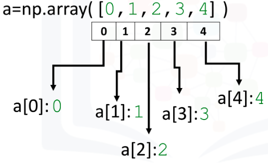

Each element is of the same type (in this case integers)

```python
# As with lists, you can access earch element via square bracket:

print("a[0]:", a[0])
print("a[1]:", a[1])
print("a[2]:", a[2])
print("a[3]:", a[3])
print("a[4]:", a[4])
```

```python
# Check the type of the array: we get numpy.ndarray
type(a)

# we can use the attribute "dtype" to obtain the data type of the array’s elements
a.dtype #output: dtype('int32')
```

### Assigning values & slicing

```python
# Create numpy array
c = np.array([20, 1, 2, 3, 4])

# Assign the first element to 100
c[0] = 100
c #output: array([100,   1,   2,   3,   4])
```

```python
# Slicing the numpy array
d = c[1:4]
d #output: array([1, 2, 3])

# Set the fourth element and fifth element to 300 and 400
c[3:5] = 300, 400
c #output array([100,   1,   2, 300, 400])
```

We can also define the steps in slicing, like this: `[start:end:step]`:

- **`start`**: The index where the slice starts (inclusive). If we don't pass start its considered 0
- **`end`**: The index where the slice ends (exclusive). If we don't pass end it considers till the length of array.
- **`step`**: The interval between each index. If we don't pass step its considered 1

```python
arr = np.array([1, 2, 3, 4, 5, 6, 7])
print(arr[1:5:2]) #output: [2 4]
print(arr[1:6:2]) #output: [2 4 6]
print(arr[:4]) #output: [1 2 3 4]
print(arr[4:]) #output: [5 6 7]
print(arr[1:5:]) #output: [2 3 4 5]
```

### Assigning value with List

Similarly, we can use a list to select more than one specific index. 

```python
# Create the index list
select = [0, 2, 3, 4]
select #output: [0, 2, 3, 4]

# Use List as argument in brackets
d = c[select]

```

### Other attributes

```python
# Create a numpy array
a = np.array([0, 1, 2, 3, 4])

# Get the size of numpy array
a.size  #output: 5

# Get the number of dimensions of numpy array
a.ndim  #output: 1

# Get the shape/size of numpy array
a.shape #output: (5,)
```

### NumPy Statistical Functions

```python
# Create a numpy array
a = np.array([1, -1, 1, -1])

# Get the mean of numpy array
mean = a.mean()

# Get the standard deviation of numpy array
standard_deviation=a.std()

# Get the biggest value in the numpy array
max_a = a.max()

# Get the smallest value in the numpy array
min_a = a.min()
```

### NumPy  1D Array Operations

```python
u = np.array([1, 0])
v = np.array([0, 1])

**# Numpy Array Addition**
z = np.add(u, v) #output: array([1, 1])
```

```python
**# Plotting functions**

import time 
import sys
import numpy as np 

import matplotlib.pyplot as plt

def Plotvec1(u, z, v):
    
    ax = plt.axes() # to generate the full window axes
    ax.arrow(0, 0, *u, head_width=0.05, color='r', head_length=0.1)# Add an arrow to the U Axes with arrow head width 0.05, color red and arrow head length 0.1
    plt.text(*(u + 0.1), 'u')#Adds the text u to the Axes 
    
    ax.arrow(0, 0, *v, head_width=0.05, color='b', head_length=0.1)# Add an arrow to the v Axes with arrow head width 0.05, color red and arrow head length 0.1
    plt.text(*(v + 0.1), 'v')#Adds the text v to the Axes 
    
    ax.arrow(0, 0, *z, head_width=0.05, head_length=0.1)
    plt.text(*(z + 0.1), 'z')#Adds the text z to the Axes 
    plt.ylim(-2, 2)#set the ylim to bottom(-2), top(2)
    plt.xlim(-2, 2)#set the xlim to left(-2), right(2)

# Plot numpy arrays

Plotvec1(u, z, v)
```

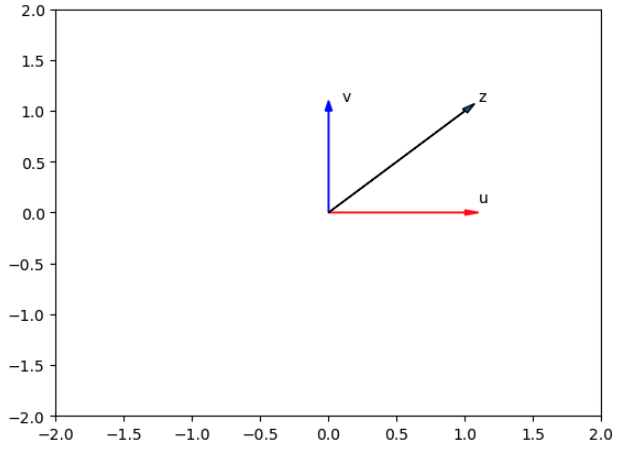

```python
**# Array subtraction**

a = np.array([10, 20, 30])
b = np.array([5, 10, 15])

c = np.subtract(a, b)
print(c) #output: [ 5 10 15]
```

```python
**# Array multiplication** 

x = np.array([1, 2])
y = np.array([2, 1])

z = np.multiply(x, y)
```

```python
**# Array division**

z = np.divide(x, y)
```

```python
**# Array dot product**

X = np.array([1, 2])
Y = np.array([3, 2])

np.dot(X,Y) #output: 7
```

The **dot product** is a mathematical operation that takes two vectors of the same size and returns a single scalar (number):

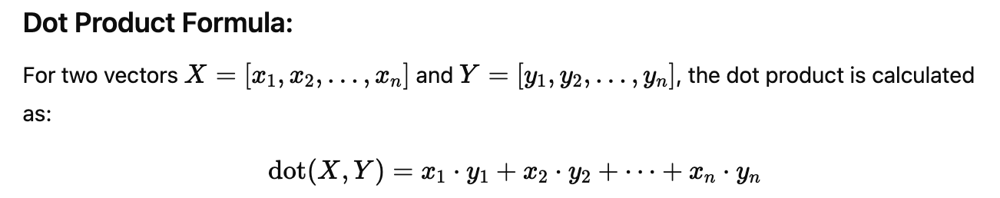

```python
# **Adding a constant**: 

u = np.array([1, 2, 3, -1]) 
u + 1 #output: array([2, 3, 4, 0]) it adds 1 to each element in the array

```

### Mathematical functions

```python
**# The value of pi**
np.pi

**# The numpy array in radians**
x = np.array([0, np.pi/2 , np.pi])
```

We can apply the function `sin` to the array `x` and assign the values to the array `y`; this applies the sine function to each element in the array:

```python
**# The sin of each element**
y = np.sin(x)
```

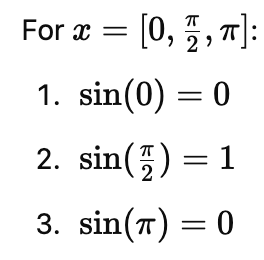

The sine function is a trigonometric function that works on angles (in radians) and produces values between -1 and 1.

```python
**# Linespace function**

# A useful function for plotting mathematical functions
# Linspace returns evenly spaced numbers over a specified interval

**# Syntax:**
# numpy.linspace(start, stop, num = int value)
# start  :  start of interval range
# stop   :  end of interval range
# num    :  Number of samples to generate.

# Makeup a numpy array within [-2, 2] and 5 elements
np.linspace(-2, 2, num=5)
# array([-2., -1.,  0.,  1.,  2.])

# Make a numpy array within [-2, 2] and 9 elements
np.linspace(-2, 2, num=9)
# array([-2. , -1.5, -1. , -0.5,  0. ,  0.5,  1. ,  1.5,  2. ])

# Make a numpy array within [0, 2π] and 100 elements 
x = np.linspace(0, 2*np.pi, num=100)
# Calculate the sine of x list
y = np.sin(x)
# Plot the result
plt.plot(x, y)
```

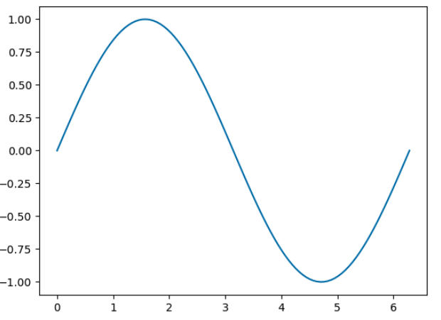

### Iterating 1D arrays

```python
arr1 = np.array([1, 2, 3])
for x in arr1:
  print(x)
```

## Two Dimensional NumPy Arrays

```python

# Import the libraries
import numpy as np

# Create a list
a = [[11, 12, 13], [21, 22, 23], [31, 32, 33]]

# Convert list to Numpy Array: every element is the same type
A = np.array(a)

# Show the numpy array dimensions
# Use the attribute ndim to obtain the number of axes or dimensions, referred to as the rank.
A.ndim  #output: 2

# Show the numpy array shape
# It returns a tuple corresponding to the size or number of each dimension
A.shape  #output: (3, 3)

# Show the numpy array size: the total number of elements in the array
A.size  #output: 9
```

### Accessing different elements of a 2D numpy array:

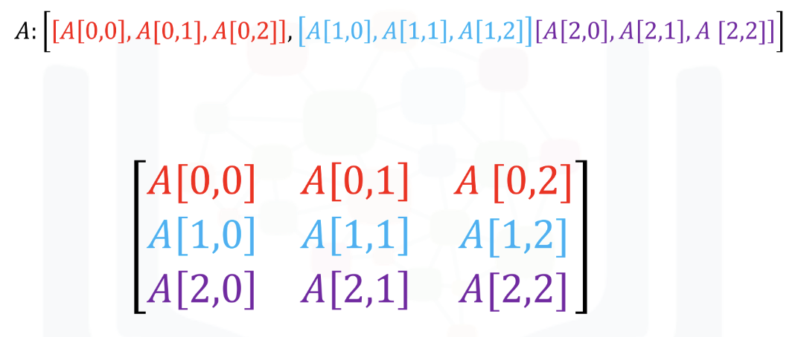

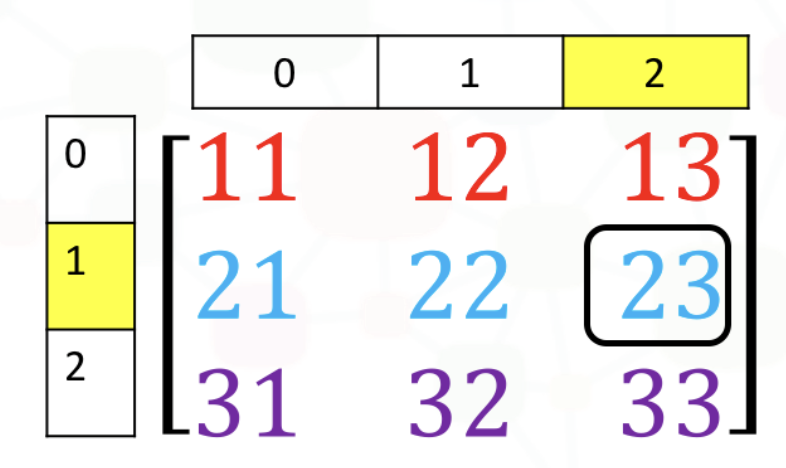

```python
# We use the square brackets and the indices corresponding to the element we would like:
A[1, 2]

# We can also use the following notation 
A[1][2]

# Output: 23 bor both
```

### Slicing in a 2D numpy array:

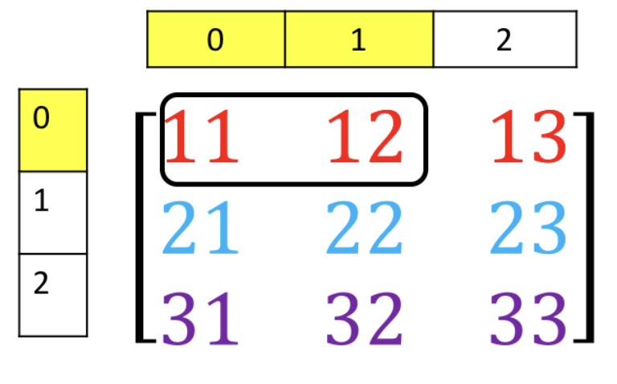

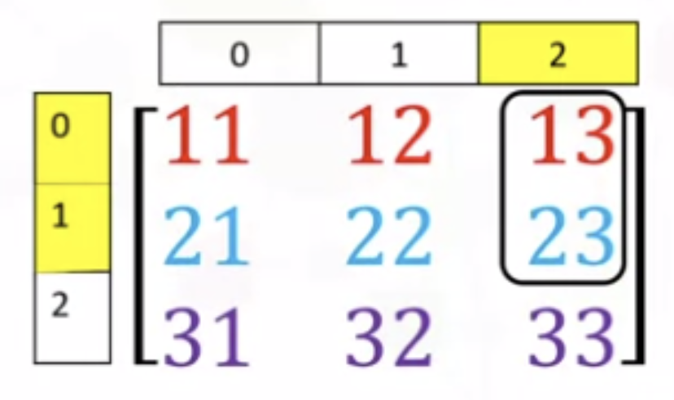

```python
# Access the element on the first row and first and second columns
A[0][0:2] #output: array([11, 12])

A[0:2, 2] #output: array([13, 23])
```

### Basic operations

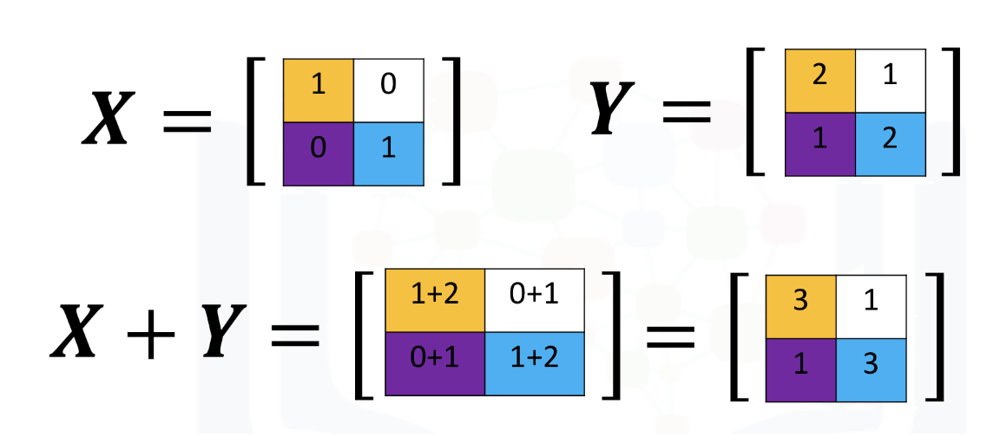

Adding

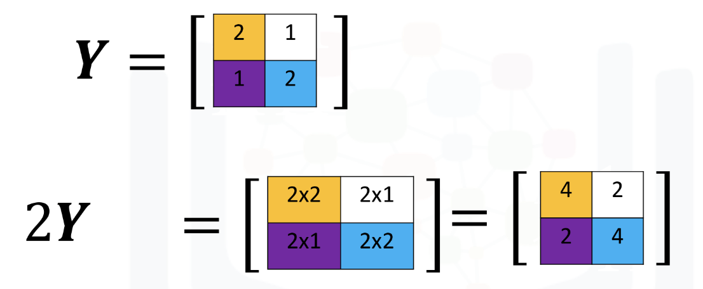

Multiplying by a scalar


Multiplication of two arrays corresponds to an element-wise product or ***Hadamard product***. Consider matrix `X` and `Y`. The Hadamard product corresponds to multiplying each of the elements in the same position, i.e. multiplying elements contained in the same color boxes together. The result is a new matrix that is the same size as matrix `Y` or `X`, as shown in the following figure

We can also perform **matrix multiplication** with the numpy arrays `A` and `B` as follows:

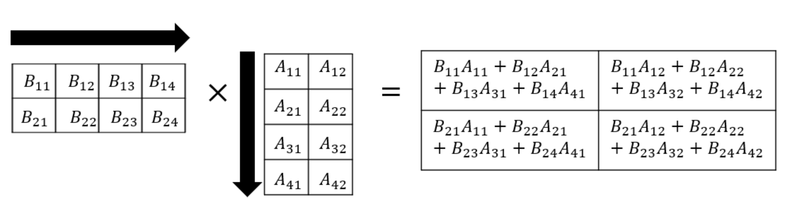

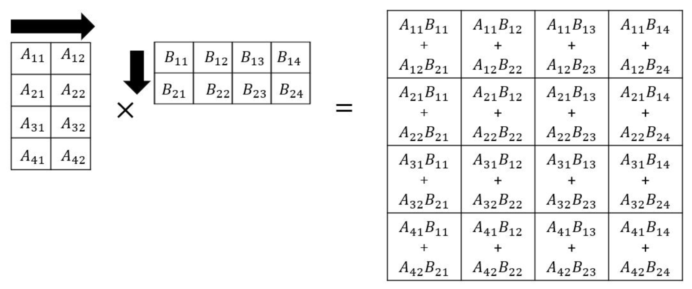

```python
# Create a matrix A
A = np.array([[0, 1, 1], [1, 0, 1]])

# Create a matrix B
B = np.array([[1, 1], [1, 1], [-1, 1]])

# Calculate the dot product
Z = np.dot(A,B)
Z # Output:
# array([[0, 2],
#       [0, 2]])

# Calculate the sine of Z
np.sin(Z)
```

```python
# # Get the transposed of C using the T attribute

C = np.array([[1,1],[2,2],[3,3]])
C # Output:
# array([[1, 1],
#        [2, 2],
#        [3, 3]])

C.T # Output:
# array([[1, 2, 3],
#        [1, 2, 3]])
```

### Matrix mathematics:

[06_Matrix_Mathematics.pdf](../../img/06_Matrix_Mathematics.pdf)

## Cheat Sheets:

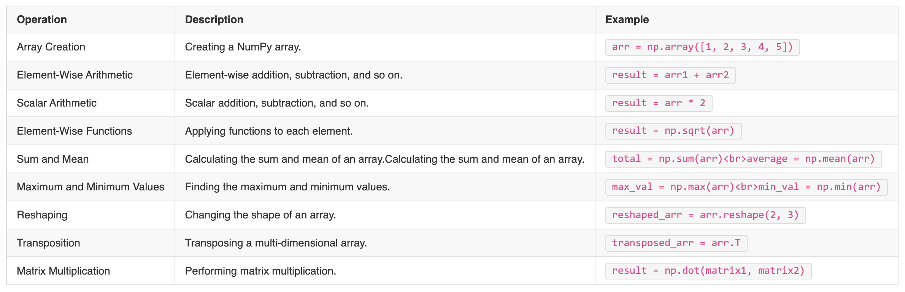