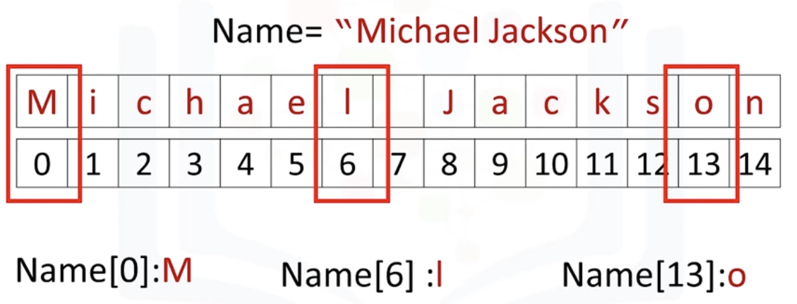
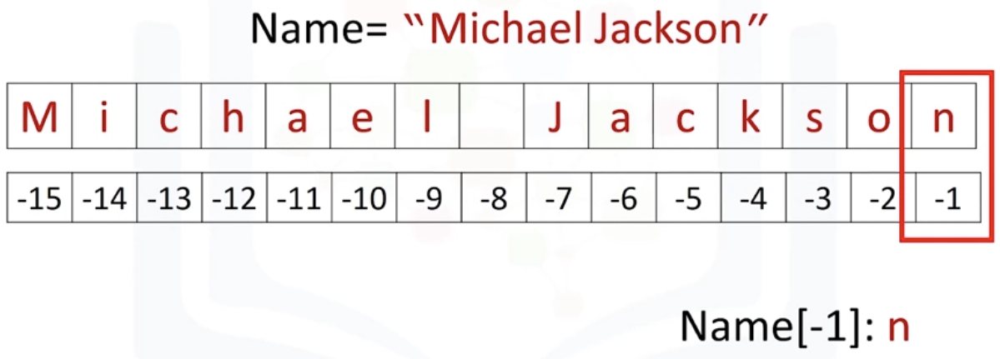
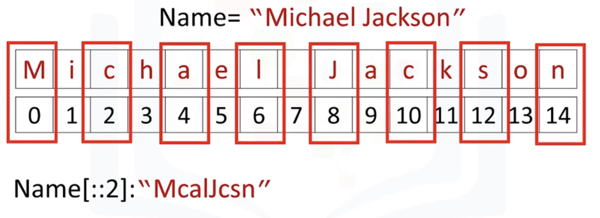
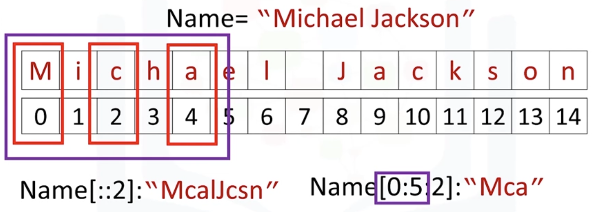
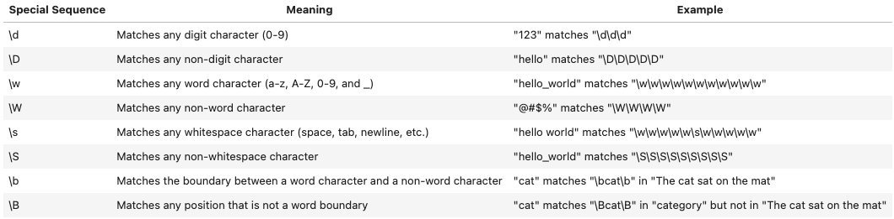

# 1.3 Operaciones con Cadenas





Es útil pensar en una cadena como una secuencia ordenada de caracteres. Cada elemento de la secuencia puede accederse mediante el índice representado por el arreglo de números. También se puede usar indexación negativa (imagen 2).

## **Operaciones Básicas: concatenación, repetición, longitud**

- **Concatenación:** Combina cadenas usando el operador `+`.
    
    ```python
    python
    Copiar código
    str1 = "Hello"
    str2 = "World"
    result = str1 + " " + str2  # Output: "Hello World"
    ```
    
- **Repetición:** Repite cadenas usando el operador `*`.
    
    ```python
    result = "Python" * 3  # Output: "PythonPythonPython
    ```
    
- **Longitud:** Usa `len()` para encontrar el número de caracteres.
    
    ```python
    length = len("Python")  # Output: 6
    ```
    

## **Indexación y Segmentación de Cadenas**

- **Indexación:** Accede a caracteres individuales usando su índice (comienza en 0).
    
    ```python
    word = "Python"
    first = word[0]  # Output: 'P'
    last = word[-1]  # Output: 'n'
    ```
    
- **Segmentación:** Extrae partes de una cadena usando `inicio:fin` (fin excluido).
    
    ```python
    substring = word[1:4]  # Output: 'yth'
    ```
    
    
    
    Podemos ingresar un valor de paso de la siguiente manera: El 2 indica que seleccionaríamos cada segunda variable. 
    
    
    
    Aquí un ejemplo que también incorpora segmentación
    

## Métodos de cadena

- **Transformaciones:**
    
    ```python
    word = "hello"
    print(word.upper())  # Output: "HELLO"
    print(word.lower())  # Output: "hello"
    print(word.capitalize())  # Output: "Hello"
    print(word.title())  # Output: "Hello"
    ```
    
- **Buscar y reemplazar:**
    
    ```python
    text = "Python is fun"
    print(text.find("is"))  
    # Output: 7. Si la subcadena no está en la cadena, la salida es -1.
    print(text.replace("fun", "awesome"))  
    # Output: "Python is awesome"
    ```
    
- **Eliminar espacios y rellenar:**
    
    ```python
    word = "  hello  "
    print(word.strip())  # Output: "hello"
    print(word.lstrip())  # Output: "hello  "
    print(word.rstrip())  # Output: "  hello"
    print(word.center(10, "-"))  # Output: "--hello---"
    ```
    

## **Verificar Condiciones**

- **Comienzos y finales:**
    
    ```python
    text = "Python programming"
    print(text.startswith("Python"))  # Output: True
    print(text.endswith("ing"))  # Output: True
    ```
    
- **Verificación de contenido:**
    
    ```python
    print("123".isdigit())  # Output: True
    print("abc".isalpha())  # Output: True
    print("Python3".isalnum())  # Output: True
    ```
    

## **Técnicas Avanzadas de Cadenas**

- **Dividir y unir:**
Sintaxis para `split`: `string.split(separator, maxsplit)`
    - separator (opcional): si no se proporciona, el separador predeterminado es cualquier espacio en blanco)
    - maxsplit (opcional): especifica el número máximo de divisiones a realizar. Si no se proporciona, no hay límite.
    
    ```python
    sentence = "Python is fun"
    words = sentence.split()  # Output: ['Python', 'is', 'fun']
    joined = " ".join(words)  # Output: "Python is fun"
    ```
    
- **Cadenas crudas:**
    
    ```python
    raw = r"C:\new_folder\file.txt"
    print(raw)  # Output: "C:\new_folder\file.txt"
    ```
    

## **Caracteres de Escape**

Usa barras invertidas para caracteres especiales:

```python
print("This is a line\nAnd this is a new line.")  # Output incluye un salto de línea
print("This is a tab\tHere")  # Output incluye un tabulador
print("This is a backslash \\")  # Output incluye 1 barra invertida
```

## Formatear cadenas

**Formatear cadenas** es una forma de inyectar variables en una cadena en Python. Producen salidas más legibles para humanos. Hay varias formas de formatear cadenas en Python:

### **Interpolación de Cadenas (f-strings)**

Introducidas en Python 3.6, las f-strings están prefijadas con `f` y usan llaves `{}` para encerrar variables.

Ejemplo:

```python
name = "John"
age = 30
print(f"My name is {name} and I am {age} years old."

#output:
My name is John and I am 30 years old.
```

### **`str.format()`**

Usa llaves `{}` como marcadores de posición y el método `format()` para inyectar variables.

Ejemplo:

```python
name = "John"
age = 50
print("My name is {} and I am {} years old.".format(name, age))

#output: My name is John and I am 50 years old.
```

### **Operador `%`**

Una de las formas más antiguas de formatear cadenas, usando `%` para reemplazo.

Ejemplo:

```python
name = "Johnathan"
age = 30
print("My name is %s and I am %d years old." % (name, age))

#output: My name is Johnathan and I am 30 years old.
```

**Explicación:**

- `%s`: Marcador de posición para una cadena.
- `%d`: Marcador de posición para un entero.
- `% (name, age)`: Tupla que contiene variables que reemplazan los marcadores de posición.

### **Capacidades Adicionales de f-strings**

Las f-strings pueden evaluar expresiones dentro de llaves.

Ejemplo:

```python
x = 10
y = 20
print(f"The sum of x and y is {x + y}.")

#output:The sum of x and y is 30.
```

### **Cadenas Crudas (`r''`)**

Las cadenas crudas manejan caracteres de escape tratando las barras invertidas (`\`) como caracteres literales.

**Ejemplo de Cadena Regular:**

```python
regular_string = "C:\new_folder\file.txt"
print("Regular String:", regular_string)

#output:
Regular String: C:
ew_folderile.txt
```

**Ejemplo de Cadena Cruda:**

```python
raw_string = r"C:\new_folder\file.txt"
print("Raw String:", raw_string)

#output:
Raw String: C:\new_folder\file.txt

```

Las cadenas crudas aseguran que las barras invertidas no se interpreten como secuencias de escape.

<aside>

**Resumen:**

- **f-strings:** Modernas, preferidas por legibilidad y rendimiento.
- **`str.format()`:** Flexibles para versiones antiguas de Python.
- **Operador `%`:** Útiles pero consideradas obsoletas.
- **Cadenas crudas:** Esenciales para manejar rutas de archivos y caracteres de escape.
</aside>

## RegEx

En Python, RegEx (abreviatura de Regular Expression) es una herramienta para coincidir y manejar cadenas.

Este módulo RegEx proporciona varias funciones para trabajar con expresiones regulares, incluyendo `search`, `split`, `findall` y `sub`.

Python proporciona un módulo incorporado llamado `re`, que te permite trabajar con expresiones regulares. Primero, importa el módulo `re`.

```python
import re

s1 = "Michael Jackson is the best"

# Define the pattern to search for
pattern = r"Jackson"

# Use the search() function to search for the pattern in the string
result = re.search(pattern, s1)

# Check if a match was found
if result:
    print("Match found!")
else:
    print("Match not found.")
```

La función search() busca patrones especificados dentro de una cadena. Aquí hay un ejemplo que explica cómo usar la función search() para buscar la palabra "Jackson" en la cadena "Michael Jackson is the best".

Las expresiones regulares (RegEx) son patrones usados para coincidir y manipular cadenas de texto. Hay varias secuencias especiales en RegEx que pueden usarse para coincidir con caracteres o patrones específicos.



Ejemplos de expresiones regulares y funciones RegEx

```python
# The \d special sequence in a regular expression pattern using **search** function:

pattern = r"\d\d\d\d\d\d\d\d\d\d"  # Matches any ten consecutive digits
text = "My Phone number is 1234567890"
match = re.search(pattern, text)

if match:
    print("Phone number found:", match.group())
else:
    print("No match")
    
#output: 
Phone number found: 1234567890
```

```python
# The \W special sequence in a regular expression pattern using **findall** function:

pattern = r"\W"  # Matches any non-word character
text = "Hello, world!"
matches = re.findall(pattern, text)

print("Matches:", matches)

#output:
Matches: [',', ' ', '!']
```

```python
# Use the **split** function to split the string by the "\s" (regular expression pattern that matches any whitespace character)
split_array = re.split(r"\s", s2)

# The split_array contains all the substrings, split by whitespace characters
print(split_array)
```

```python
#The **sub** function of a regular expression is used to replace all occurrences of a pattern in a string.

# Define the regular expression pattern to search for
pattern = r"King of Pop"

# Define the replacement string
replacement = "legend"

# Use the sub function to replace the pattern with the replacement string
new_string = re.sub(pattern, replacement, s2, flags=re.IGNORECASE)

# The new_string contains the original string with the pattern replaced by the replacement string
print(new_string) 
```