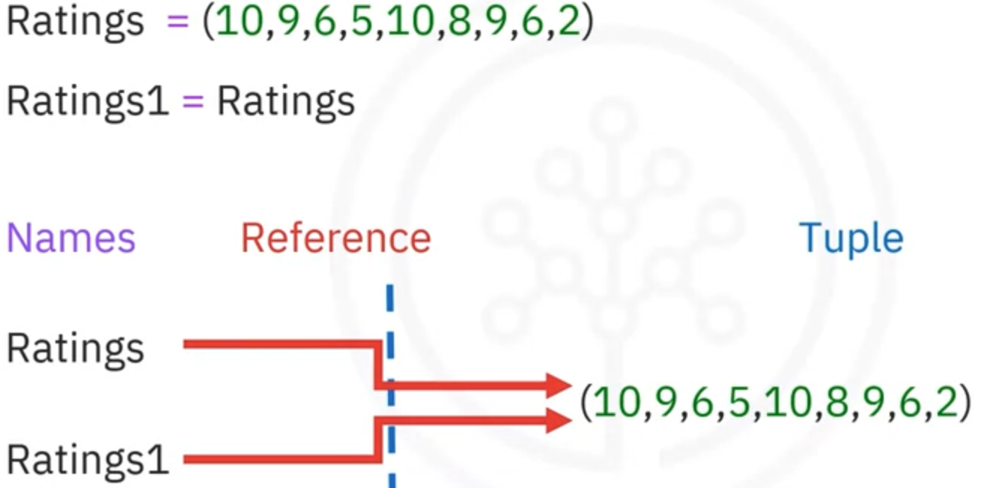
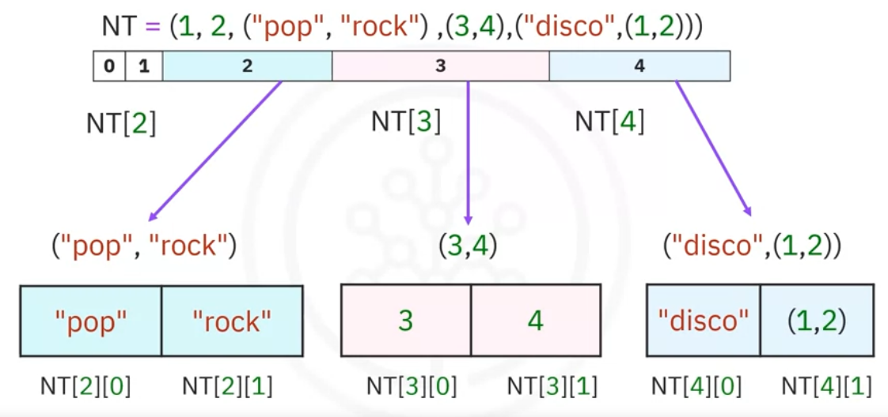

# 2.1 Tuplas () (inmutables)

- Las tuplas son una secuencia ordenada, expresada como elementos separados por comas dentro de paréntesis.
- En Python, hay diferentes tipos: cadenas, enteros, flotantes. Todos pueden estar contenidos en una tupla pero el tipo de la variable es tupla.
- Cada elemento de una tupla puede accederse mediante un índice.
- Podemos concatenar o combinar tuplas sumándolas. También podemos segmentarlas.

```python
tuple1=(1, 2.2, “hello”)
type(tuple1)= tuple
tuple1[0]= 1
tuple1[-1]="hello"

**#Concatenando**
tuple2 = tuple1 + ("andrea", 10) #output: (1, 2.2, "hello", "andrea", 10)

**#Segmentando**
tupple2[3:5] #output: ("andrea", 10)
**len**(tupple2) #output: 5

#**Ordenando**
Ratings = (0, 9, 6, 5, 10, 8, 9, 6, 2)
RatingsSorted = **sorted**(Ratings)
```

- Las tuplas son **inmutables:**
    
    
    
    Cada variable no contiene una tupla, sino que hace referencia al mismo objeto tupla inmutable. 
    
    Como consecuencia de la inmutabilidad, si queremos manipular una tupla debemos crear una nueva tupla en su lugar. Por ejemplo, si queremos ordenar una tupla usamos la función `sorted` : 
    
    ```python
    Ratings = (10, 9, 6, 7)
    RatingsSorted = **sorted**(Ratings)
    ```
    
- Una tupla puede contener otras tuplas así como otros tipos de datos complejos. Esto se llama anidamiento:
    
    ```python
    NT = (1, 2, ("pop", "rock"), (3, 4,), ("disco, (1, 2)))
    ```
    
    We can access these elements using the standard indexing methods
    
    
    
- **Uso**: Generalmente usadas para representar colecciones fijas de elementos (ej. coordinadas).