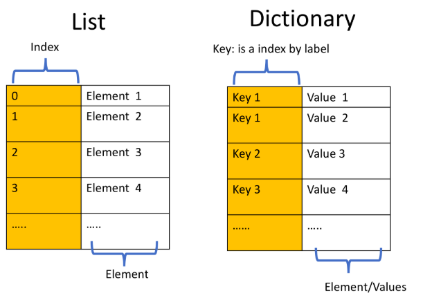

# 2.3 Diccionarios {”clave”: valor}

- Un diccionario consiste en **claves** y **valores**. Es útil comparar un diccionario con una lista:
    
    
    
- En lugar de estar indexado numéricamente como una lista, los diccionarios tienen claves. Estas claves son las que se usan para acceder a los valores dentro de un diccionario.
- Cada clave está separada de su valor por dos puntos "`:`". Las comas separan los elementos, y todo el diccionario está encerrado en llaves. Un diccionario vacío sin elementos se escribe con solo dos llaves, como esto `{}`.
- Para cada clave, solo puede haber un valor único, sin embargo, múltiples claves pueden tener el mismo valor. Las claves solo pueden ser cadenas, números o tuplas, pero los valores pueden ser cualquier tipo de dato.

```python
#Las claves pueden ser cadenas, pero también pueden ser cualquier objeto inmutable, como una tupla:
Dict = {"key1": 1, "key2": "2", (0, 1): 6} 
Dict["key1"] #output: 1
Dict[(0, 1)] #output: 6    

# Ejemplo de diccionario:
release_year_dict = {"Thriller": "1982", "Back in Black": "1980", \
                    "The Dark Side of the Moon": "1973", "The Bodyguard": "1992", \
                    "Bat Out of Hell": "1977", "Their Greatest Hits (1971-1975)": "1976", \
                    "Saturday Night Fever": "1977", "Rumours": "1977"}

# Obtener valor por clave
release_year_dict['The Bodyguard']     

# Obtener todas las claves en el diccionario
release_year_dict.**keys**()  

# Obtener todos los valores en el diccionario
release_year_dict.**values**()                        

# Agregar valor con clave al diccionario
release_year_dict['Graduation'] = '2007'

# Eliminar entradas por clave
**del**(release_year_dict['Thriller'])

# Verificar si la clave está en el diccionario
'The Bodyguard' **in** release_year_dict #output: True
```