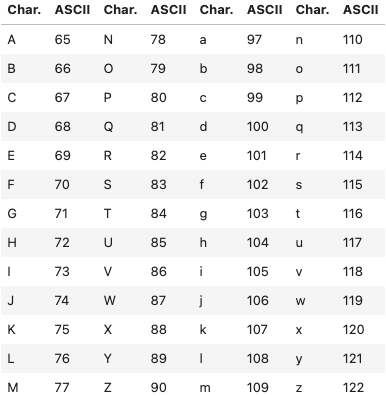

# 3.1 Condiciones y Ramificación

## Operadores de Comparación

Las operaciones de comparación comparan algún valor u operando y, basado en una condición, producen un Booleano. Al comparar dos valores puedes usar estos operadores:

- igual: **==**
- no igual: **!=**
- mayor que: **>**
- menor que: **<**
- mayor o igual que: **>=**
- menor o igual que: **<=**

```python
#Ejemplos

# Signo Mayor Que
i = 2
i > 5 #output: False

# Signo de Desigualdad
i = 2
i != 6 #output: True

# Comparando las cadenas
"ACDC" != "Michael Jackson" #output: True
```

<aside>

La operación de desigualdad también se usa para comparar las letras/palabras/símbolos de acuerdo al valor ASCII de las letras. El valor decimal mostrado en la siguiente tabla representa el orden del carácter:



Por ejemplo, el código ASCII para **!** es 33, mientras que el código ASCII para **+** es 43. Por lo tanto **+** es más grande que **!** ya que 43 es mayor que 33.

`'B' > 'A’` → True

Cuando hay múltiples letras, la primera letra toma precedencia en el ordenamiento:

`'BA' > 'AB’` → True 

**Nota**: Las letras mayúsculas tienen diferente código ASCII que las minúsculas, lo que significa que la comparación entre letras en Python es sensible a mayúsculas.

</aside>

## Ramificación

La ramificación nos permite ejecutar diferentes declaraciones para diferentes entradas. Es útil pensar en una **declaración if** como una habitación cerrada, si la declaración es **True** podemos entrar en la habitación y tu programa ejecutará algunas tareas predefinidas, pero si la declaración es **False** el programa ignorará la tarea. 

- Podemos usar las declaraciones de condición aprendidas antes como las condiciones que necesitan ser verificadas en la **declaración if**. La sintaxis es tan simple como `if *declaración de condición* :`, que contiene una palabra `if`, cualquier declaración de condición, y dos puntos al final. Comienza tus tareas que necesitan ser ejecutadas bajo esta condición en una nueva línea con una indentación. Las líneas de código después de los dos puntos y con indentación solo serán ejecutadas cuando la **declaración if** sea **True**. Las tareas terminarán cuando la línea de código no contenga la indentación.
    
    ```python
    # Ejemplo de declaración if
    age = 18
    #age = 19 
    
    #expresión que puede ser true o false
    if age > 18:
        
        #dentro de una indentación, tenemos la expresión que se ejecuta si la condición es true
        print("you can enter" )
    
    #Las declaraciones después de la declaración if se ejecutarán independientemente si la condición es true o false 
    print("move on")
    ```
    
- La declaración `else` ejecuta un bloque de código si ninguna de las condiciones son **True** antes de esta declaración `else`. La sintaxis de la declaración `else` es similar a la sintaxis de la declaración `if`, como `else :`. Nota que, no hay declaración de condición para `else`.
    
    ```python
    # Ejemplo de declaración else
    age = 18
    #age = 19 
    
    if age > 18:
        print("you can enter" )
    else:
        print("go see Meat Loaf" )
        
    print("move on")
    ```
    
- La declaración `elif`, abreviatura de else if, nos permite verificar condiciones adicionales si las declaraciones de condición antes de ella son **False**. Si la condición para la declaración `elif` es **True**, las expresiones alternas serán ejecutadas. La sintaxis de la declaración `elif` es similar en que simplemente cambiamos el `if` en la declaración `if` a `elif`.
    
    ```python
    # Ejemplo de declaración elif
    
    age = 18
    
    if age > 18:
        print("you can enter" )
    elif age == 18:
        print("go see Pink Floyd")
    else:
        print("go see Meat Loaf" )
        
    print("move on")
    ```

## Operadores Lógicos

A veces quieres verificar más de una condición a la vez. Por ejemplo, podrías querer verificar si una condición y otra condición son ambas **True**. Los operadores lógicos te permiten combinar o modificar condiciones.

- `and`
- `or`
- `not`

```python
# Ejemplo de declaración de condición

album_year = 1980

if(album_year > 1979) and (album_year < 1990):
    print ("Album year was in between 1980 and 1989")
    
print("")
print("Do Stuff..")

#output: 
#Album year was in between 1980 and 1989

#Do Stuff.
```

```python
# Ejemplo de declaración de condición

album_year = 1990

if(album_year < 1980) or (album_year > 1989):
    print ("Album was not made in the 1980's")
else:
    print("The Album was made in the 1980's ")
    
#output:
#Album was not made in the 1980's
```

```python
# Ejemplo de declaración de condición

album_year = 1983

if not (album_year == 1984):
    print ("Album year is not 1984")
    
#output:
#Album year is not 1984
```