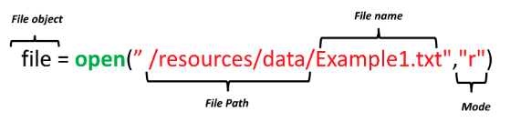
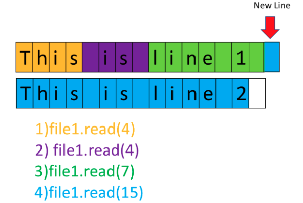
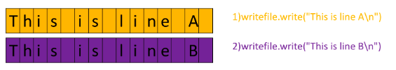

# 4.1 Lectura y Escritura de archivos con Open

# Lectura de archivos con `open`

## Abriendo el archivo usando la función open de Python

Una forma de leer o escribir un archivo en Python es usar la función incorporada `open`. La función `open` proporciona un **Objeto File** que contiene los métodos y atributos que necesitas para leer, guardar y manipular el archivo. Toma dos parámetros primarios:

1. **Ruta del archivo**: El parámetro de ruta del archivo consiste en el nombre del archivo y el directorio donde se encuentra el archivo.
2. **Modo**: El parámetro de modo especifica el propósito de abrir el archivo, como 'r' para lectura, 'w' para escritura, o 'a' para agregar.
    
    
    

> **Nota**: solo cubriremos archivos **.txt**.
> 

```python
# Leer el Example1.txt
example1 = "example1.txt"
file1 = open(example1, "r")

# Imprimir la ruta del archivo
file1.name #output: 'example1.txt'

# Imprimir el modo del archivo, ya sea 'r' o 'w'
file1.mode #output: 'r'

# Leer el archivo
FileContent = file1.read()
FileContent #output: 'This is line 1 \nThis is line 2\nThis is line 3'. The /n means that there is a new line.

# Imprimir el archivo
print(FileContent) # Se imprimirá con las nuevas líneas en lugar de \n.

# Tipo de contenido del archivo
type(FileContent) #output: str

# Cerrar el archivo: Esencial para que los recursos no se desperdicien
file1.close()
```

## Abriendo el archivo usando declaración `with`

Para simplificar el manejo de archivos y asegurar el cierre adecuado de archivos, Python proporciona la declaración `with`. Usar la declaración `with` es **mejor práctica**, cierra automáticamente el archivo incluso si el código encuentra una excepción. El código ejecutará todo en el bloque indentado luego cerrará el objeto archivo. 

```python
# Abrir archivo usando with

with open(example1, "r") as file1:
    FileContent = file1.read()
    print(FileContent) 
    
# Verificar si el archivo está cerrado
file1.closed #output: True

# Ver el contenido del archivo
print(FileContent) #imprime el contenido del archivo
```

## Realizando operaciones de lectura en un archivo

### 1. Leyendo el contenido completo

Puedes leer el contenido completo de un archivo usando el método read, que almacena los datos como una cadena en una variable. Este contenido puede ser impreso o manipulado más como sea necesario.

```python
# Leyendo y Almacenando el Contenido Completo de un Archivo
# Usando el método read, puedes recuperar el contenido completo de un archivo
# y almacenarlo como una cadena en una variable para procesamiento o display adicional.

# Paso 1: Abrir el archivo que quieres leer
with open('file.txt', 'r') as file:    

# Paso 2: Usar el método read para leer el contenido completo del archivo    
file_stuff = file.read()    

# Paso 3: Ahora que el contenido del archivo está almacenado en la variable 'file_stuff',    
# puedes manipularlo o mostrarlo como sea necesario.    
# Por ejemplo, vamos a imprimir el contenido a la consola:    
print(file_stuff)

# Paso 4: La declaración 'with' cierra automáticamente el archivo cuando termina,
# asegurando manejo adecuado de recursos y previniendo fugas de recursos.
```

**Paso 1**: Involucra abrir el archivo, especificando 'file.txt' como el archivo a abrir para lectura ('r') modo usando el administrador de contexto with.

**Paso 2**: Utiliza la declaración `read()` en el objeto archivo (file) para leer el archivo completo. Este contenido luego se almacena en la variable file_stuff.

**Paso 3**: Explica que con el contenido ahora almacenado en file_stuff, puedes realizar varias operaciones en él. En el ejemplo proporcionado, el código imprime el contenido a la consola, pero puedes manipular, analizar, buscar o procesar los datos de texto en file_stuff basado en tus necesidades específicas.

**Paso 4**: Enfatiza que el bloque with cierra automáticamente el archivo cuando termina, asegurando manejo adecuado de recursos y previniendo fugas de recursos. Este es un aspecto crucial de usar la declaración with cuando trabajas con archivos.

### 3. Leyendo caracteres específicos

Puedes especificar el número de caracteres a leer.

```python
# Leer cierta cantidad de caracteres

with open(example1, "r") as file1:
    print(file1.read(4))
    print(file1.read(4))
    print(file1.read(7))
    print(file1.read(15))
```



> **Navegar a la posición intencionada (Opcional)**
Si quieres leer caracteres desde una posición específica en el archivo, puedes usar el método seek(). Este método mueve el puntero del archivo (como un cursor) a una posición particular. La posición se especifica en bytes, así que necesitarás saber el offset de bytes de los caracteres que quieres leer.
`file.seek(10)  # Mover al 11vo byte (índice basado en 0)`
> 

### 2. Leyendo el contenido línea por línea

Python proporciona métodos para leer archivos línea por línea:

- El método `readlines()` lee el archivo línea por línea y almacena cada línea como un elemento en una lista. El orden de líneas en la lista corresponde a su orden en el archivo.
- El método `readline()` lee líneas individuales del archivo. Puede ser llamado múltiples veces para leer líneas subsiguientes.

```python
# Leer todas las líneas y guardar como una lista
with open(example1, "r") as file1:
    FileasList = file1.readlines()

print(FileasList) #output: ['This is line 1 \n', 'This is line 2\n', 'This is line 3']

```

```python
# Leer una línea
with open(example1, "r") as file1:
    print("first line: " + file1.readline())
```

```python
# Podemos pasar un argumento a readline() para especificar el número de caracteres que queremos leer.
# A diferencia de read(), readline() solo puede leer una línea a lo sumo.
with open(example1, "r") as file1:
    print(file1.readline(20)) # no lee más allá del fin de línea
    print(file1.read(20)) # Devuelve los siguientes 20 chars
```

```python
# Iterar a través de las líneas
with open(example1,"r") as file1:
        i = 0;
        for line in file1:
            print("Iteration", str(i), ": ", line)
            i = i + 1
```

# Escritura de archivos con `open`

### Escritura de archivos con modo ‘w’

Podemos abrir un objeto archivo usando el método `write()` para guardar el archivo de texto a una lista. Para escribir a un archivo, el argumento de modo debe ser establecido a **w**. 

```python
# Escribir línea a archivo
exmp2 = '/Example2.txt'
with open(exmp2, 'w') as writefile:
    writefile.write("This is line A")

# Para ver si funcionó, podemos leer el archivo
with open(exmp2, 'r') as testwritefile:
    print(testwritefile.read()) #output: This is line A
```

```python
# Escribir múltiples líneas a archivo
with open(exmp2, 'w') as writefile:
    writefile.write("This is line A\n")
    writefile.write("This is line B\n")
```

El método `.write()` funciona similar al método `.readline()`, excepto en lugar de leer una nueva línea escribe una nueva línea. El proceso se ilustra en la figura. La diferente codificación de color de la cuadrícula representa una nueva línea agregada al archivo después de cada llamada a método.



```python
# Escribimos una lista a un archivo .txt como sigue:

Lines = ["This is line A\n", "This is line B\n", "This is line C\n"]

with open('/Example2.txt', 'w') as writefile:
    for line in Lines:
        print(line)
        writefile.write(line)
```

> **Nota que establecer el modo a w sobrescribe todos los datos existentes en el archivo.**
> 

### Agregando archivos con modo ”a”

```python
# Escribir una nueva línea a archivo de texto

with open('/Example2.txt', 'a') as testwritefile:
    testwritefile.write("This is line C\n")
    testwritefile.write("This is line D\n")
    testwritefile.write("This is line E\n")
```

### Modos adicionales

`.write()` escribe en una cierta ubicación en el archivo. `.read()` lee en una cierta ubicación en el archivo y así sucesivamente. 

Abrir el archivo en **w** es similar a abrir el archivo .txt, mover tu cursor al principio del archivo de texto, escribir nuevo texto y borrar todo lo que sigue. Abrir el archivo en **a** es similar a abrir el archivo .txt, mover tu cursor al final y luego agregar las nuevas piezas de texto.

A menudo es muy útil saber dónde está el 'cursor' en un archivo y poder controlarlo. Los siguientes métodos nos permiten hacer precisamente esto:

- `.tell()` → devuelve la posición actual en bytes
- `.seek(offset,from)` → cambia la posición por 'offset' bytes con respecto a 'from'. From puede tomar el valor de 0,1,2 correspondiente a principio, relativo a posición actual y fin

Es bastante ineficiente abrir el archivo en **a** o **w** y luego reabrirlo en **r** para leer cualquier línea. Afortunadamente podemos acceder al archivo en los siguientes modos:

- **r+** : Abre el archivo para **tanto lectura como escritura**. El puntero del archivo comienza al principio del archivo. Puedes **leer de** y **escribir a** el archivo sin truncar su contenido. Si el archivo no existe, lanza un `FileNotFoundError`.
- **w+** : Abre el archivo para **escritura y lectura**. El archivo es **truncado** (limpiado de contenidos existentes) cuando se abre. Si el archivo no existe, se crea.
- **a+** : Abre el archivo para **tanto agregar como leer**. El puntero del archivo se coloca al final del archivo, así que cualquier dato nuevo se agrega. También puedes leer el contenido existente, pero podrías necesitar usar `.seek(0)` para resetear el puntero al principio. Si el archivo no existe, se crea.

```python
with open('/Example2.txt', 'a+') as testwritefile:
    print("Initial Location: {}".format(testwritefile.tell()))
    
    data = testwritefile.read()
    if (not data):  #cadenas vacías devuelven false en python
            print('Read nothing') 
    else: 
            print(testwritefile.read())
            
    testwritefile.seek(0,0) # mover 0 bytes desde el principio.
    
    print("\nNew Location : {}".format(testwritefile.tell()))
    data = testwritefile.read()
    if (not data): 
            print('Read nothing') 
    else: 
            print(data)
    
    print("Location after read: {}".format(testwritefile.tell()) )
```

> Nota sobre la diferencia entre **w+** y **r+**. Ambos de estos modos permiten acceso a métodos de lectura y escritura, sin embargo, abrir un archivo en **w+** lo sobrescribe y borra todos los datos preexistentes. Para trabajar con un archivo en datos existentes, usa **r+** y **a+**. Mientras usas **r+**, puede ser útil agregar un método `.truncate()` al final de tus datos. Esto reducirá el archivo a tus datos y borrará todo lo que sigue.
> 

```python
with open('/Example2.txt', 'r+') as testwritefile:
    testwritefile.seek(0,0) #escribir al principio del archivo
    testwritefile.write("Line 1" + "\n")
    testwritefile.write("Line 2" + "\n")
    testwritefile.write("Line 3" + "\n")
    testwritefile.write("Line 4" + "\n")
    testwritefile.write("finished\n")
    #Descomenta la línea abajo
    testwritefile.truncate()
    testwritefile.seek(0,0)
    print(testwritefile.read())
```

## Cómo copiar un archivo

```python
# Copiar archivo a otro

with open('/Example2.txt','r') as readfile:
    with open('/Example3.txt','w') as writefile:
          for line in readfile:
                writefile.write(line)
      
                
# Verificar si la copia se ejecutó exitosamente

with open('/Example3.txt','r') as testwritefile:
    print(testwritefile.read())
```

## Ejercicio de Laboratorio

El club de fans de Raptors de tu universidad local mantiene un registro de sus miembros activos en un documento .txt. Cada mes actualizan el archivo removiendo los miembros que no están activos. Has sido encargado de automatizar esto con tus habilidades de Python.

Dado el archivo `currentMem`, remueve cada miembro con un 'no' en su columna Active. Mantén un registro de cada uno de los miembros removidos y agrégalos al archivo `exMem`. Asegúrate de que el formato de los archivos originales se preserve. (*Pista: Haz esto leyendo/escribiendo líneas completas y asegurando que el header permanezca*)

```python
# Solución: 

def cleanFiles(currentMem,exMem):
    with open(currentMem,'r+') as writeFile: 
        with open(exMem,'a+') as appendFile:
            #obtener los datos
            writeFile.seek(0)
            members = writeFile.readlines()
            #remover header
            header = members[0]
            members.pop(0)
                
            inactive = [member for member in members if ('no' in member)]
            '''
            Lo de arriba es lo mismo que 

            for member in members:
            if 'no' in member:
                inactive.append(member)
            '''
            #ir al principio del archivo de escritura
            writeFile.seek(0) 
            writeFile.write(header)
            for member in members:
                if (member in inactive):
                    appendFile.write(member)
                else:
                    writeFile.write(member)      
            writeFile.truncate()        
```

```python
# otra solución (con ayuda/explicaciones de chatGPT)

def cleanFiles(currentMem, exMem):
    # Abrir currentMem en modo r+ para lectura y sobrescritura
    with open(currentMem, 'r+') as read_file:
        # Abrir exMem en modo a+ para agregar
        with open(exMem, 'a+') as append_file:
            # Leer el header y filas de miembros
            header = read_file.readline()  # Almacenar el header
            all_members = read_file.readlines()  # Leer el resto del archivo
            
            # Crear listas separadas para miembros activos e inactivos
            active_members = []
            inactive_members = []
            
            # Procesar cada miembro
            for member in all_members:
                if 'no' in member:  # Si el miembro está inactivo
                    inactive_members.append(member)
                else:  # Si el miembro está activo
                    active_members.append(member)
            
            # Agregar miembros inactivos a exMem
            append_file.writelines(inactive_members)
            
            # Resetear puntero de archivo para currentMem y escribir de vuelta miembros activos
            read_file.seek(0)
            read_file.write(header)  # Escribir el header de vuelta
            read_file.writelines(active_members)  # Escribir miembros activos
            read_file.truncate()  # Remover cualquier línea restante del archivo
            
# Ejecutar la función cleanFiles
memReg = '/members.txt'
exReg = '/inactive.txt'
cleanFiles(memReg, exReg)

# Viendo los archivos
headers = "Membership No  Date Joined  Active  \n"
with open(memReg, 'r') as read_file:
    print("Active Members: \n\n")
    print(read_file.read())

with open(exReg, 'r') as read_file:
    print("Inactive Members: \n\n")
    print(read_file.read())

```