# 5.3 Web Scraping

## Introducción al web scraping

El web scraping, también conocido como web harvesting o web data extraction, es el proceso de extraer información de sitios web o páginas web. Involucra la recuperación automatizada de datos de fuentes web. La gente lo usa para varias aplicaciones como análisis de datos, minería, comparación de precios, agregación de contenido, y más.

## Cómo funciona el web scraping

- **Solicitud HTTP**
El proceso típicamente comienza con una solicitud HTTP. Un web scraper envía una solicitud HTTP a una URL específica, similar a cómo un navegador web lo haría cuando visitas un sitio web. La solicitud es usualmente una solicitud HTTP GET, que recupera el contenido de la página web.
- **Recuperación de página web**
El servidor web que aloja el sitio web responde a la solicitud devolviendo el contenido HTML de la página web solicitada. Este contenido incluye el texto y elementos multimedia visibles y la estructura HTML subyacente que define el diseño de la página.
- **Análisis HTML**
Una vez que se recibe el contenido HTML, necesitas analizar el contenido. El análisis involucra desglosar la estructura HTML en componentes, como etiquetas, atributos y contenido de texto. Puedes usar BeautifulSoup en Python. Crea una representación estructurada del contenido HTML que puede ser fácilmente navegada y manipulada.
- **Extracción de datos**
Con el contenido HTML analizado, los web scrapers ahora pueden identificar y extraer los datos específicos que necesitan. Estos datos pueden incluir texto, enlaces, imágenes, tablas, precios de productos, artículos de noticias, y más. Los scrapers localizan los datos buscando etiquetas HTML relevantes, atributos y patrones en la estructura HTML.
- **Transformación de datos**
Los datos extraídos pueden necesitar procesamiento y transformación adicionales. Por ejemplo, puedes remover etiquetas HTML del texto, convertir formatos de datos, o limpiar datos desordenados. Este paso asegura que los datos estén listos para análisis u otros casos de uso.
- **Almacenamiento**
Después de la extracción y transformación, puedes almacenar los datos raspados en varios formatos, como bases de datos, hojas de cálculo, JSON, o archivos CSV. La elección del formato de almacenamiento depende de los requisitos específicos del proyecto.
- **Automatización**
En muchos casos, scripts o programas automatizan el web scraping. Estas herramientas de automatización permiten la extracción recurrente de datos de múltiples páginas web o sitios web. El scraping automatizado es especialmente útil para recopilar datos de sitios web dinámicos que actualizan regularmente su contenido.

## Estructura HTML

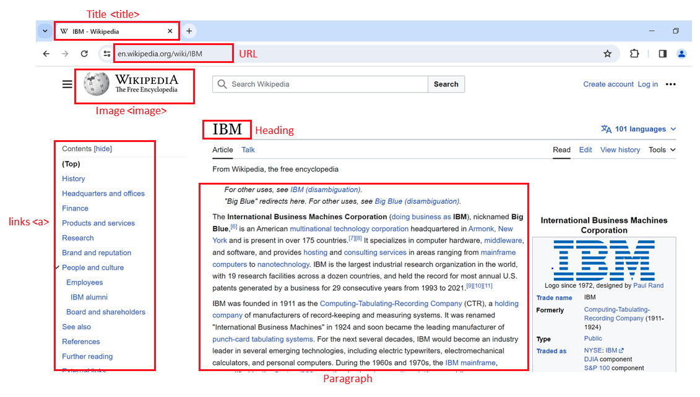

El lenguaje de marcado de hipertexto (HTML) sirve como la base de las páginas web. Entender su estructura es crucial para el web scraping.

- `<html>` es el elemento raíz de una página HTML.
- `<head>` contiene meta-información sobre la página HTML.
- `<body>` muestra el contenido en la página web, a menudo los datos de interés.
- `<h3>` las etiquetas son encabezados de tipo 3, haciendo el texto más grande y negrita, típicamente usados para nombres de jugadores.
- `<p>` las etiquetas representan párrafos y contienen información de salario de jugadores.

### Composición de una etiqueta HTML

Las etiquetas HTML definen la estructura del contenido web y pueden contener atributos.

- Una etiqueta HTML consiste de una etiqueta de apertura (inicio) y una etiqueta de cierre (fin).
- Las etiquetas tienen nombres (`<a>` para una etiqueta de ancla).
- Las etiquetas pueden contener atributos con un nombre de atributo y valor, proporcionando información adicional a la etiqueta.

### Árbol de documento HTML

Puedes visualizar documentos HTML como árboles con etiquetas como nodos.

- Las etiquetas pueden contener cadenas y otras etiquetas, haciéndolas los hijos de la etiqueta.
- Las etiquetas dentro de la misma etiqueta padre se consideran hermanas.
- Por ejemplo, la etiqueta `<html>` contiene tanto `<head>` como `<body>`, haciéndolos descendientes de `<html` pero hijos de `<html>`. `<head>` y `<body>` son hermanas.

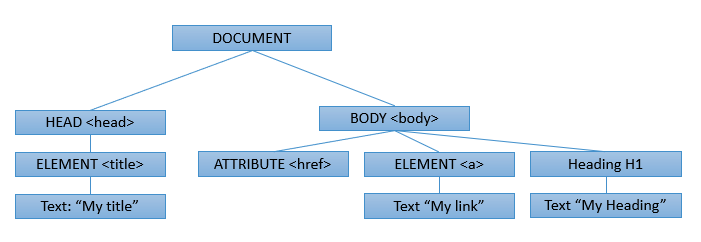

### Tablas HTML

Las tablas HTML son esenciales para presentar datos estructurados.

- Define una tabla HTML usando la etiqueta `<table>`.
- Cada fila de tabla se define con una etiqueta `<tr>`.
- La primera fila a menudo usa la etiqueta de encabezado de tabla, típicamente `<th>`.
- La celda de tabla está representada por etiquetas `<td>`, definiendo celdas individuales en una fila.

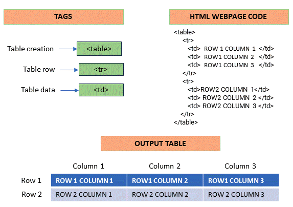

## Web Scraping de Tablas usando Pandas

La biblioteca Pandas en Python contiene una función `read_html()` que puede ser usada para extraer información tabular de cualquier página web.

Considera el siguiente ejemplo:

Asumamos que queremos extraer la lista de los bancos más grandes del mundo por capitalización de mercado, del siguiente enlace:

`URL = 'https://en.wikipedia.org/wiki/List_of_largest_banks'`

Podemos usar la función `pandas.read_html()` en python para extraer todas las tablas en la página web directamente. 

Podemos ver que la tabla requerida es la primera en la página web. 

Podemos ejecutar las siguientes líneas de código para extraer la tabla requerida de la página web. 

```python
import pandas as pd
URL = 'https://en.wikipedia.org/wiki/List_of_largest_banks'
tables = pd.read_html(URL)
df = tables[0]print(df)
```

Esto extraerá la tabla requerida como un dataframe `df`. La salida de la declaración print se vería como se muestra abajo.

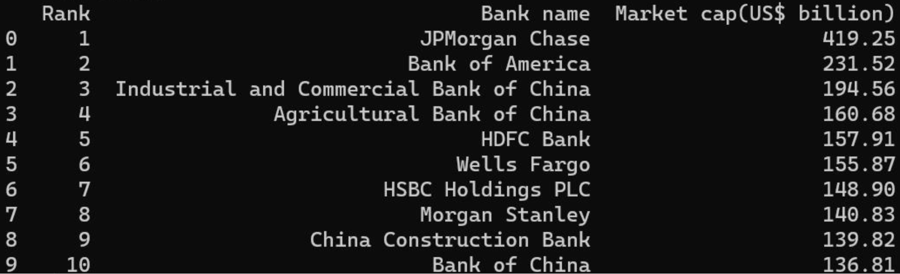

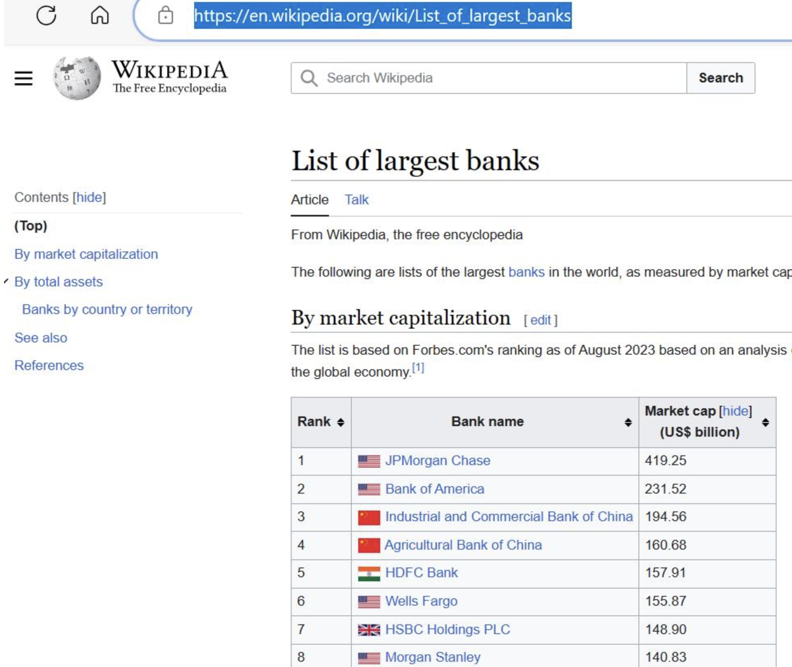

Una captura de la página web

Aunque conveniente, este método viene con su propio conjunto de limitaciones.

Primero, las páginas web pueden tener contenido guardado en ellas como tablas pero pueden no aparecer como tablas en la página web. Por ejemplo, considera la siguiente URL mostrando la lista de países por PIB (nominal).

`URL = 'https://en.wikipedia.org/wiki/List_of_countries_by_GDP_(nominal)'`

Las imágenes en la página web también se guardan en formato tabular:

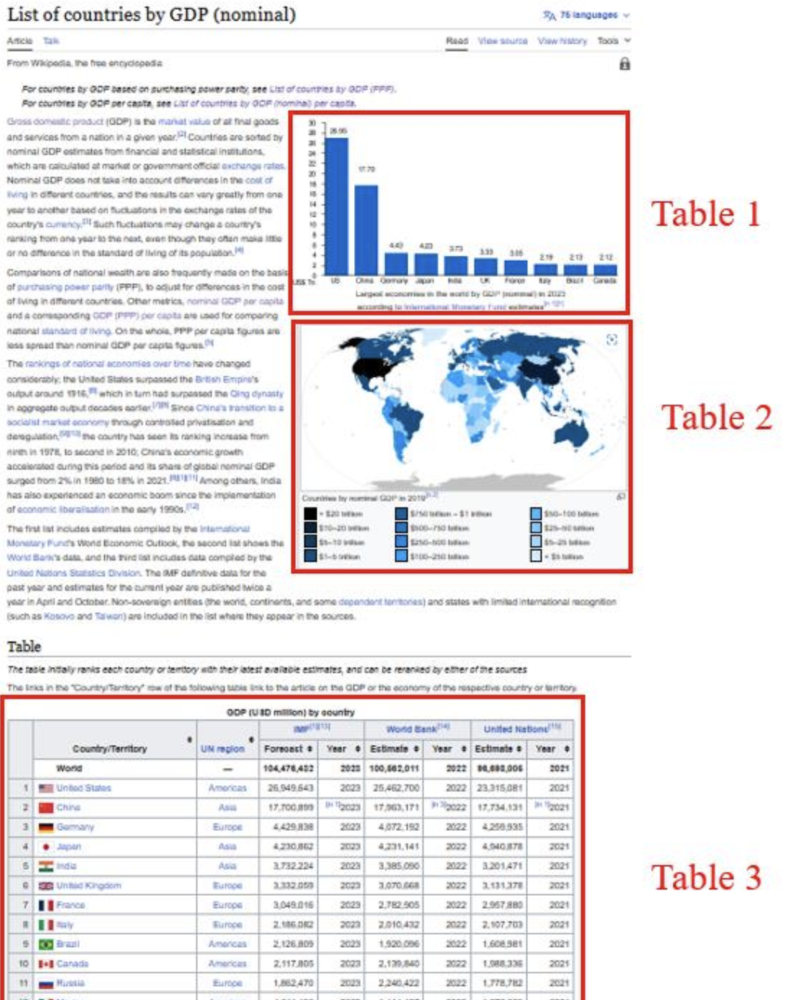

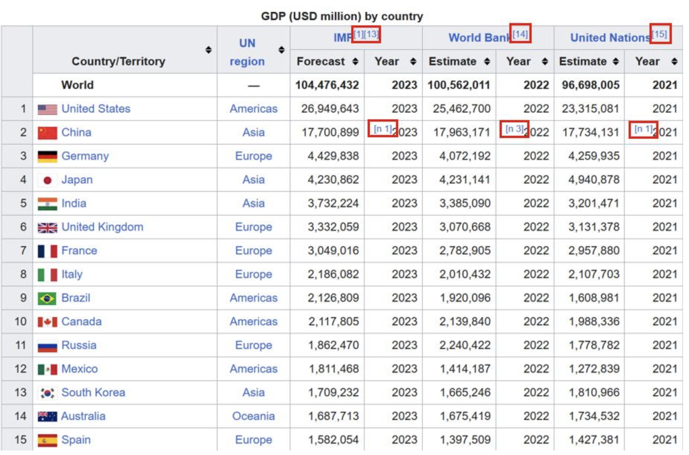

Una mirada más cercana a la tabla 3 en la imagen mostrada arriba indica que hay muchos textos de hiperenlaces que también van a ser tratados como información por la función pandas.

Segundo, los contenidos de las tablas en las páginas web pueden contener elementos como texto de hiperenlace y otros denotadores, que también se raspan directamente usando el método pandas. Esto puede llevar a un requisito de limpieza adicional de datos.

Podemos extraer la tabla usando el código mostrado abajo.

```python
import pandas as pd
URL = 'https://en.wikipedia.org/wiki/List_of_countries_by_GDP_(nominal)'
tables = pd.read_html(URL)
df = tables(2) # la tabla requerida tendrá índice 2
print(df)
```

La salida de la declaración print se muestra abajo.

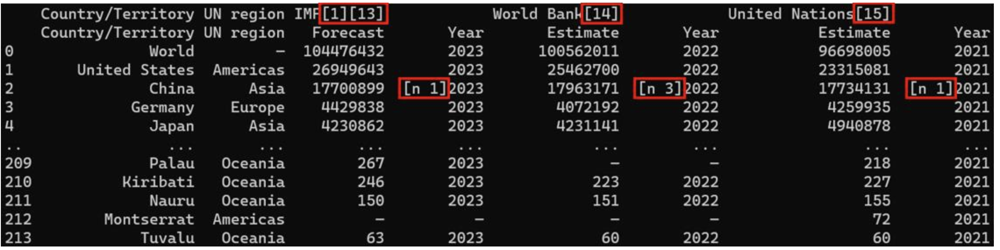

Nota que los textos de hiperenlaces también han sido retenidos en la salida del código.

Es además prudente señalar, que este método opera exclusivamente solo en extracción de datos tabulares. La biblioteca BeautifulSoup sigue siendo el método por defecto de extraer cualquier tipo de información de páginas web.

## Herramientas / bibliotecas de web scraping

En el campo de la ciencia de datos, el web scraping juega un rol integral. Involucra extraer información de páginas web usando Python y se usa para varios propósitos como:

1. **Recolección de Datos:** El web scraping es un método primario de recopilar datos de internet. Estos datos pueden ser usados para análisis, investigación, etc.
2. **Aplicación en Tiempo Real:** El web scraping se usa para aplicaciones en tiempo real como actualizaciones del clima, comparación de precios, etc.
3. **Aprendizaje Automático:** El web scraping proporciona los datos necesarios para entrenar modelos de aprendizaje automático.

Python proporciona varias bibliotecas para web scraping:

1. **BeautifulSoup:** BeautifulSoup es una biblioteca de Python usada para propósitos de web scraping para extraer los datos de archivos HTML y XML. Crea un árbol de análisis del código fuente de la página que puede ser usado para extraer datos de manera jerárquica y más legible.

```python
from bs4 import BeautifulSoup
import requests

URL = "http://www.example.com"
page = requests.get(URL)
soup = BeautifulSoup(page.content, "html.parser")
```

1. **Scrapy:** Scrapy es un framework de crawling web colaborativo y de código abierto para Python. Se usa para extraer los datos del sitio web.

```python
import scrapy

class QuotesSpider(scrapy.Spider):    
	name = "quotes"    
	start_urls = ['http://quotes.toscrape.com/tag/humor/',]    
	def parse(self, response):        
			for quote in response.css('div.quote'):
					yield {'quote': quote.css('span.text::text').get()}
```

1. **Selenium:** Selenium es una herramienta usada para controlar navegadores web a través de programas y automatizar tareas del navegador.

```python
from selenium import webdriver

driver = webdriver.Firefox()
driver.get("http://www.example.com")
```

## Obteniendo y analizando HTML con Requests y Beautiful Soup

**Beautiful Soup** es una biblioteca de Python para extraer datos de archivos HTML y XML, nos enfocaremos en archivos HTML. Esto se logra representando el HTML como un conjunto de objetos con métodos usados para analizar el HTML. Podemos navegar el HTML como un árbol, y/o filtrar lo que estamos buscando.

Para comenzar el web scraping, necesitas obtener el contenido HTML de una página web y analizarlo usando Beautiful Soup. Aquí hay un ejemplo paso a paso:

```python
import requests 
from bs4 import BeautifulSoup

#Especifica la URL de la página web que quieres raspar
url = 'https://en.wikipedia.org/wiki/IBM'

# Envía una solicitud HTTP GET a la página web
response = requests.get(url)

# Almacena el contenido HTML en una variable
html_content = response.text

# Crea un objeto BeautifulSoup para analizar el HTML
soup = BeautifulSoup(html_content, 'html.parser')

# Muestra un fragmento del contenido HTML
print(html_content[:500])
```

### Navegando la estructura HTML

BeautifulSoup representa el contenido HTML como una estructura tipo árbol, permitiendo navegación fácil. Puedes usar métodos como `find_all` para filtrar y extraer elementos HTML específicos. Por ejemplo, para encontrar todas las etiquetas de ancla () e imprimir su texto:

```python
# Encuentra todas las etiquetas <a> (etiquetas de ancla) en el HTML
links = soup.find_all('a') 

# Itera a través de la lista de enlaces e imprime su texto
for the link in links:
    print(link.text)
```

Considera el siguiente HTML: 

```html
%%html
<!DOCTYPE html>
<html>
<head>
<title>Page Title</title>
</head>
<body>
<h3><b id='boldest'>Lebron James</b></h3>
<p> Salary: $ 92,000,000 </p>
<h3> Stephen Curry</h3>
<p> Salary: $85,000, 000 </p>
<h3> Kevin Durant </h3>
<p> Salary: $73,200, 000</p>
</body>
</html>
```

```python
from bs4 import BeautifulSoup # este módulo ayuda en web scrapping.
import requests  # este módulo nos ayuda a descargar una página web

html="<!DOCTYPE html><html><head><title>Page Title</title></head><body><h3><b id='boldest'>Lebron James</b></h3><p> Salary: $ 92,000,000 </p><h3> Stephen Curry</h3><p> Salary: $85,000, 000 </p><h3> Kevin Durant </h3><p> Salary: $73,200, 000</p></body></html>"
soup = BeautifulSoup(html, 'html5lib')
```

- **Etiquetas**
    
    Digamos que queremos el título de la página y el nombre del jugador mejor pagado. Podemos usar el `Tag`. El objeto `Tag` corresponde a una etiqueta HTML en el documento original, por ejemplo, la etiqueta title.
    
    ```python
    tag_object**=**soup.title
    print("tag object:",tag_object) #output: tag object: <title>Page Title</title>
    print("tag object type:",type(tag_object))#output: tag object type: <class 'bs4.element.Tag'>
    ```
    
    Si hay más de una `Tag` con el mismo nombre, se llama al primer elemento con ese nombre de `Tag`. 
    
    ```python
    tag_object=soup.h3
    tag_object # output: <h3><b id="boldest">Lebron James</b></h3>
    ```
    
- **Hijos, padres y hermanos**
    
    ```python
    tag_child=tag_object.b
    tag_child #output: <b id="boldest">Lebron James</b>
    
    tag_parent=parent_tag=tag_child.parent
    parent_tag #output: <h3><b id="boldest">Lebron James</b></h3>
    
    sibling_1=tag_object.next_sibling
    sibling_1 #output: <p> Salary: $ 92,000,000 </p>
    
    sibling_2=sibling_1.next_sibling
    sibling_2 #output: <h3> Stephen Curry</h3>
    ```
    
- **Atributos HTML**
    
    Si la etiqueta tiene atributos, la etiqueta `id="boldest"` tiene un atributo `id` cuyo valor es `boldest`. 
    
    ```python
    # Puedes acceder a los atributos de una etiqueta tratándola como un diccionario:
    tag_child['id'] #output: 'boldest'
    
    # Puedes acceder a ese diccionario directamente como attrs:
    tag_child.attrs #output: {'id': 'boldest'}
    
    # También podemos obtener el contenido del atributo de la etiqueta usando el método get() de Python.
    tag_child.get('id') #output: 'boldest'
    ```
    
- **Cadena Navegable**
    
    Una cadena corresponde a un poco de texto o contenido dentro de una etiqueta. Beautiful Soup usa la clase `NavigableString` para contener este texto. En nuestro HTML podemos obtener el nombre del primer jugador extrayendo la cadena del objeto `Tag` `tag_child` como sigue:
    
    ```python
    tag_string=tag_child.string
    tag_string #output: 'Lebron James'
    
    type(tag_string) #output: bs4.element.NavigableString
    ```
    
    Una NavigableString es similar a una cadena de Python o cadena Unicode. Para ser más preciso, la diferencia principal es que también soporta algunas características de `BeautifulSoup`. Podemos convertirla a objeto de cadena en Python:

    ```python
    unicode_string = str(tag_string)
    
    type(unicode_string) #output: str
    ```
    

### Método `find_all()`

Considera el siguiente HTML: 

```html
%%html
<table>
  <tr>
    <td id='flight' >Flight No</td>
    <td>Launch site</td> 
    <td>Payload mass</td>
   </tr>
  <tr> 
    <td>1</td>
    <td><a href='https://en.wikipedia.org/wiki/Florida'>Florida</a></td>
    <td>300 kg</td>
  </tr>
  <tr>
    <td>2</td>
    <td><a href='https://en.wikipedia.org/wiki/Texas'>Texas</a></td>
    <td>94 kg</td>
  </tr>
  <tr>
    <td>3</td>
    <td><a href='https://en.wikipedia.org/wiki/Florida'>Florida<a> </td>
    <td>80 kg</td>
  </tr>
</table>
```

```python
table="<table><tr><td id='flight'>Flight No</td><td>Launch site</td> <td>Payload mass</td></tr><tr> <td>1</td><td><a href='https://en.wikipedia.org/wiki/Florida'>Florida<a></td><td>300 kg</td></tr><tr><td>2</td><td><a href='https://en.wikipedia.org/wiki/Texas'>Texas</a></td><td>94 kg</td></tr><tr><td>3</td><td><a href='https://en.wikipedia.org/wiki/Florida'>Florida<a> </td><td>80 kg</td></tr></table>"
table_bs = BeautifulSoup(table, 'html5lib')
```

El método `find_all()` busca a través de los descendientes de una etiqueta y recupera todos los descendientes que coincidan con tus filtros.

**Sintaxis**: `find_all(name, attrs, recursive, string, limit, **kwargs)`

- **`name`**
    
    Cuando establecemos el parámetro `name` a un nombre de etiqueta, el método extraerá todas las etiquetas con ese nombre y sus hijos:
    
    ```python
    table_rows=table_bs.find_all('tr')
    table_rows 
    ```
    
    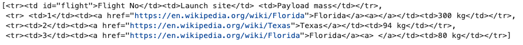
    
    ```python
    first_row =table_rows[0]
    first_row #output: <tr><td id="flight">Flight No</td><td>Launch site</td> <td>Payload mass</td></tr>
    
    # El tipo es Tag
    print(type(first_row))#output: <class 'bs4.element.Tag'>
    
    # Para obtener el hijo: 
    first_row.td #output: <td id="flight">Flight No</td>
    ```
    
    Si iteramos a través de la lista, cada elemento corresponde a una fila en la tabla:
    
    ```python
    for i,row in enumerate(table_rows):
        print("row",i,"is",row)
    ```
    
    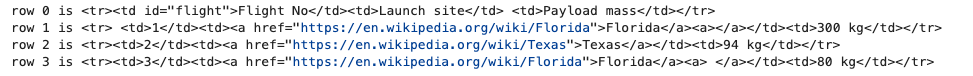
    
    Como `row` es un objeto `cell`, podemos aplicar el método `find_all` a él y extraer celdas de tabla en el objeto `cells` usando la etiqueta `td`, esto es todos los hijos con el nombre `td`. El resultado es una lista, cada elemento corresponde a una celda y es un objeto `Tag`, podemos iterar a través de esta lista también. Podemos extraer el contenido usando el atributo `string`.
    
    ```python
    for i,row in enumerate(table_rows):
        print("row",i)
        cells=row.find_all('td')
        for j,cell in enumerate(cells):
            print('colunm',j,"cell",cell)
    ```
    
    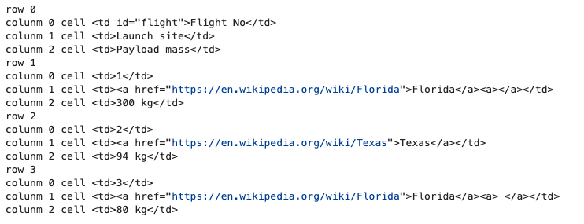
    
    Si usamos una lista podemos coincidir contra cualquier elemento en esa lista.
    
    ```python
    list_input=table_bs .find_all(name=["tr", "td"])
    list_input
    ```
    
    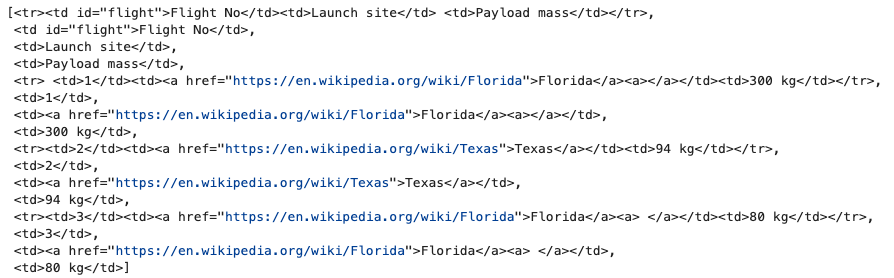
    
- **`attrs`**
    
    Si el argumento no es reconocido será convertido en un filtro en los atributos de la etiqueta. Por ejemplo con el argumento `id`, Beautiful Soup filtrará contra cada atributo `id` de la etiqueta.
    
    ```python
    # Ejemplos: 
    # Filtrando basado en el valor id
    table_bs.find_all(id="flight") #output:[<td id="flight">Flight No</td>]
    
    # Encuentra todos los elementos que tienen enlaces a la página de Wikipedia de Florida:
    list_input=table_bs.find_all(href="https://en.wikipedia.org/wiki/Florida")
    list_input #output: 
    #[<a href="https://en.wikipedia.org/wiki/Florida">Florida</a>,
    # <a href="https://en.wikipedia.org/wiki/Florida">Florida</a>]
    
    # Si establecemos el atributo href a True, 
    # sin importar cuál sea el valor, el código encuentra todas las etiquetas con valor href:
    table_bs.find_all(href=True) #output:
    #[<a href="https://en.wikipedia.org/wiki/Florida">Florida</a>,
    # <a href="https://en.wikipedia.org/wiki/Texas">Texas</a>,
    # <a href="https://en.wikipedia.org/wiki/Florida">Florida</a>]
    ```
    
- **`string`**
    
    Con string puedes buscar cadenas en lugar de etiquetas, donde encontramos todos los elementos con Florida:
    
    ```python
    table_bs.find_all(string="Florida")
    ```
    

### Método `find()`

Es útil si estás buscando un elemento, ya que puedes usar el método `find()` para encontrar el primer elemento en el documento.

```python
two_tables="<h3>Rocket Launch </h3><p><table class='rocket'><tr><td>Flight No</td><td>Launch site</td> <td>Payload mass</td></tr><tr><td>1</td><td>Florida</td><td>300 kg</td></tr><tr><td>2</td><td>Texas</td><td>94 kg</td></tr><tr><td>3</td><td>Florida </td><td>80 kg</td></tr></table></p><p><h3>Pizza Party  </h3><table class='pizza'><tr><td>Pizza Place</td><td>Orders</td> <td>Slices </td></tr><tr><td>Domino's Pizza</td><td>10</td><td>100</td></tr><tr><td>Little Caesars</td><td>12</td><td >144 </td></tr><tr><td>Papa John's </td><td>15 </td><td>165</td></tr>"
two_tables_bs= BeautifulSoup(two_tables, 'html.parser')

# Podemos encontrar la primera tabla usando el nombre de etiqueta table
two_tables_bs.find("table")

# Podemos filtrar en el atributo class para encontrar la segunda tabla, 
# pero porque class es una palabra clave en Python, agregamos un guión bajo para diferenciarlos.
two_tables_bs.find("table",class_='pizza')
```

## **Descargando Y Raspando El Contenido De Una Web**

### Ejemplo 1: Enlaces, imágenes

Descargamos el contenido de la página web. Usamos `get` para descargar el contenido de la página web en formato texto y almacenar en una variable llamada `data`. Creamos un objeto `BeautifulSoup` usando el constructor `BeautifulSoup`:

```python
url = "http://www.ibm.com"
data  **=** requests.get(url).text
soup **=** BeautifulSoup(data,"html5lib")  *# crea un objeto soup usando la variable 'data'*
```

**Raspa todos los enlaces:**

```python
**for** link **in** soup.find_all('a',href**=True**):  *# en html anchor/link está representado por la etiqueta <a>*
print(link.get('href'))
```

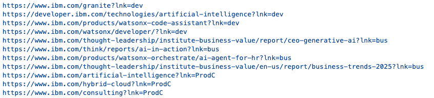

**Raspa todas las etiquetas de Imágenes:**

```python
**for** link **in** soup.find_all('img'):*# en html image está representado por la etiqueta *
print(link)
print(link.get('src'))
```

### Ejemplo 2: Tablas

**Raspa datos de tablas HTML:**

```python
#The below url contains an html table with data about colors and color codes.

url = "https://cf-courses-data.s3.us.cloud-object-storage.appdomain.cloud/IBM-DA0321EN-SkillsNetwork/labs/datasets/HTMLColorCodes.html"
data = requests.get(url).text
soup = BeautifulSoup(data,"html5lib")
```

> Antes de proceder a raspar un sitio web, necesitas examinar los contenidos y la manera en que los datos están organizados en el sitio web. Abre la url arriba en tu navegador y verifica cuántas filas y columnas hay en la tabla de colores.
> 

```python
#find a html table in the web page
table = soup.find('table') # in html table is represented by the tag <table>

#Get all rows from the table*
for row in table.find_all('tr'): # in html table row is represented by the tag <tr>

*# Get all columns in each row.
cols = row.find_all('td') # in html a column is represented by the tag <td>

color_name = cols[2].string # store the value in column 3 as color_name
color_code = cols[3].string # store the value in column 4 as color_code

print("{}--->{}".format(color_name,color_code))
```

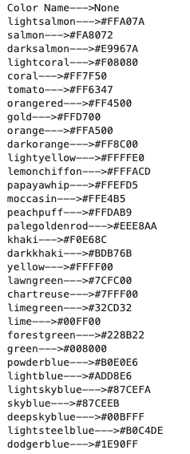